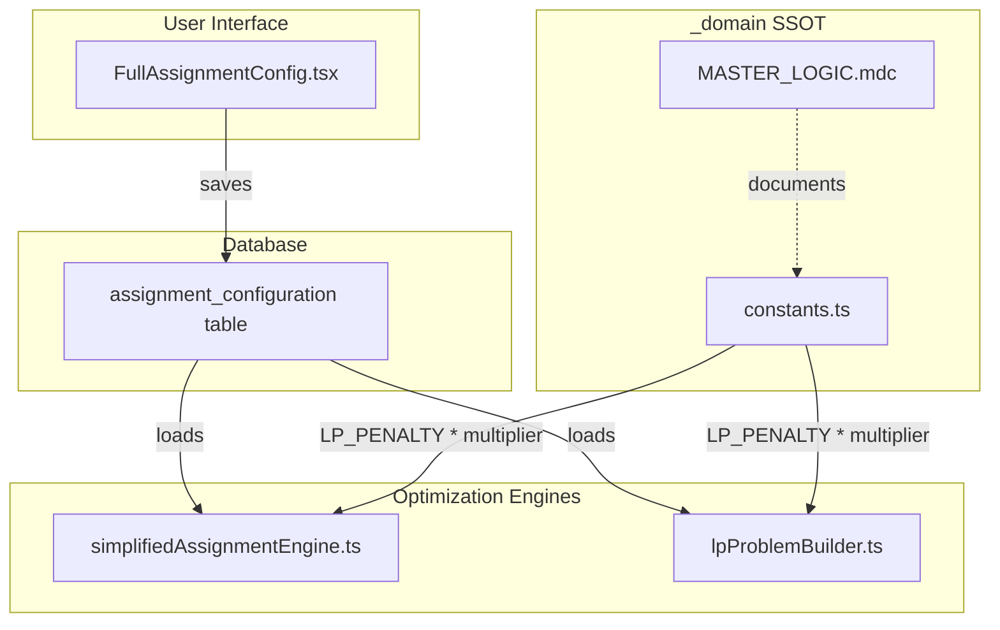

# Balance Intensity Configuration

## Problem

The LP solver's balance penalties are hardcoded at values that often let continuity "win" over balance. Users need a way to tune this trade-off based on their priorities:
- Some teams want to preserve relationships even if books are uneven
- Other teams need strictly balanced books and will sacrifice some continuity

## Solution

Add a **Balance Intensity** dial with 5 presets that multiply all balance penalties (Alpha, Beta, BigM) for ARR, ATR, and Pipeline metrics.

| Intensity | Multiplier | Effect |
|-----------|------------|--------|
| Very Light | 0.1x | Continuity almost always wins |
| Light | 0.5x | Slight preference for balance |
| Normal | 1.0x | Current behavior (default) |
| Heavy | 3.0x | Balance often overrides continuity |
| Very Heavy | 10.0x | Balance dominates |

## Architecture



## Implementation Steps

### Step 1: Document in MASTER_LOGIC.mdc (Section 11.3.1)

Add new subsection documenting the balance intensity feature, formula, and presets.

**File:** [`src/_domain/MASTER_LOGIC.mdc`](book-ops-workbench/src/_domain/MASTER_LOGIC.mdc)

### Step 2: Add constants to _domain/constants.ts

Add `BALANCE_INTENSITY_PRESETS`, `BalanceIntensity` type, and `getBalancePenaltyMultiplier()` helper.

**File:** [`src/_domain/constants.ts`](book-ops-workbench/src/_domain/constants.ts)

```typescript
export const BALANCE_INTENSITY_PRESETS = {
  VERY_LIGHT: { label: 'Very Light', multiplier: 0.1 },
  LIGHT: { label: 'Light', multiplier: 0.5 },
  NORMAL: { label: 'Normal', multiplier: 1.0 },
  HEAVY: { label: 'Heavy', multiplier: 3.0 },
  VERY_HEAVY: { label: 'Very Heavy', multiplier: 10.0 },
} as const;

export type BalanceIntensity = keyof typeof BALANCE_INTENSITY_PRESETS;

export function getBalancePenaltyMultiplier(intensity: BalanceIntensity): number {
  return BALANCE_INTENSITY_PRESETS[intensity].multiplier;
}
```

### Step 3: Export from _domain/index.ts

Add exports for the new constants and type.

**File:** [`src/_domain/index.ts`](book-ops-workbench/src/_domain/index.ts)

### Step 4: Update LPBalanceConfig type

Add `balance_intensity` field to the config interface.

**File:** [`src/services/optimization/types.ts`](book-ops-workbench/src/services/optimization/types.ts)

```typescript
export interface LPBalanceConfig {
  // ... existing fields ...
  balance_intensity?: BalanceIntensity;  // Default: 'NORMAL'
}
```

### Step 5: Update Relaxed Model (lpProblemBuilder.ts)

Modify `buildMetricPenaltyTerms()` to accept and apply the intensity multiplier to all three metrics (ARR, ATR, Pipeline).

**File:** [`src/services/optimization/constraints/lpProblemBuilder.ts`](book-ops-workbench/src/services/optimization/constraints/lpProblemBuilder.ts)

Key change in penalty calculation:
```typescript
const intensity = config.lp_balance_config.balance_intensity ?? 'NORMAL';
const intensityMultiplier = getBalancePenaltyMultiplier(intensity);

const alphaPenalty = PENALTY.ALPHA * weight * intensityMultiplier;
const betaPenalty = PENALTY.BETA * weight * intensityMultiplier;
const bigMPenalty = PENALTY.BIG_M * weight * intensityMultiplier;
```

### Step 6: Update Waterfall Model (simplifiedAssignmentEngine.ts)

The waterfall engine currently only applies balance penalties to ARR. Need to:
1. Import `getBalancePenaltyMultiplier` from `@/_domain`
2. Read `balance_intensity` from config
3. Apply multiplier to the ARR penalty terms (lines 962-967)

**File:** [`src/services/simplifiedAssignmentEngine.ts`](book-ops-workbench/src/services/simplifiedAssignmentEngine.ts)

Note: Waterfall only does ARR balance currently - ATR/Pipeline balance would require additional work if needed.

### Step 7: Add database column

Add `balance_intensity` column to `assignment_configuration` table.

**File:** New migration in `supabase/migrations/`

```sql
ALTER TABLE assignment_configuration 
ADD COLUMN balance_intensity TEXT DEFAULT 'NORMAL';
```

### Step 8: Update Supabase types

Regenerate or manually add the column to the TypeScript types.

**File:** [`src/integrations/supabase/types.ts`](book-ops-workbench/src/integrations/supabase/types.ts)

### Step 9: Add UI control in FullAssignmentConfig.tsx

Add a radio group or slider for balance intensity in the configuration panel.

**File:** [`src/components/FullAssignmentConfig.tsx`](book-ops-workbench/src/components/FullAssignmentConfig.tsx)

- Add to ConfigState interface
- Add to initial state (default: 'NORMAL')
- Add to save/load logic
- Add UI component (RadioGroup with descriptions)

## Testing Considerations

1. **Very Light**: Run optimization, verify continuity rate is high even with unbalanced books
2. **Very Heavy**: Run optimization, verify books are balanced even if continuity drops
3. **Both models**: Test with waterfall and relaxed_optimization modes
4. **All metrics**: Verify ARR, ATR, and Pipeline penalties all scale correctly

## Changelog Entry

```markdown
## [YYYY-MM-DD] - SSOT: Balance Intensity Configuration

**Changes:**
1. **Updated MASTER_LOGIC.mdc Section 11.3.1** - Documented balance intensity feature
2. **Added to _domain/constants.ts** - BALANCE_INTENSITY_PRESETS, getBalancePenaltyMultiplier()
3. **Updated optimization/types.ts** - Added balance_intensity to LPBalanceConfig
4. **Updated lpProblemBuilder.ts** - Apply intensity multiplier to ARR/ATR/Pipeline penalties
5. **Updated simplifiedAssignmentEngine.ts** - Apply intensity multiplier to ARR penalties
6. **Added migration** - balance_intensity column in assignment_configuration
7. **Updated FullAssignmentConfig.tsx** - Added Balance Intensity radio group
```
