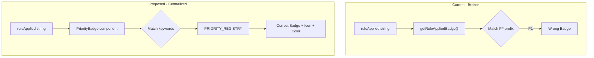

# Centralized Priority Badge Component

## Problem

The `getRuleAppliedBadge()` function in `AssignmentPreviewDialog.tsx` uses hardcoded P# position matching (P0, P1, P2, etc.), but priority positions are configurable and vary by mode. This causes wrong badges to display.

**Example:** In COMMERCIAL mode, `geo_and_continuity` is P4, but the code checks `rule.startsWith('P1:')` for Continuity+Geo badge.

## Solution Architecture



## Files to Change

### 1. Create new component: [`src/components/ui/PriorityBadge.tsx`](book-ops-workbench/src/components/ui/PriorityBadge.tsx)

New centralized component that:
- Accepts `ruleApplied` string prop
- Matches on **priority ID keywords** (not P# positions)
- Returns appropriate Badge with icon and color

```typescript
interface PriorityBadgeProps {
  ruleApplied: string;
  showLabel?: boolean;  // Show text label or just icon
}
```

**Keyword matching logic:**
| Priority ID | Keywords to Match | Icon | Color |
|-------------|-------------------|------|-------|
| `manual_holdover` | "manual", "strategic", "holdover" | Shield | amber |
| `sales_tools_bucket` | "sales tools" | TrendingUp | orange |
| `stability_accounts` | "stability", "stable", "cre", "renewal soon", "pe firm" | Shield | amber |
| `geo_and_continuity` | "continuity" + "geo" together | Users | green |
| `geography` | "geographic", "geography" (without "continuity") | Globe | blue |
| `continuity` | "continuity" (without "geo") | Users | purple |
| `team_alignment` | "team" + "alignment" | Users | indigo |
| `arr_balance` | "residual", "best available", "balance", "RO:" | TrendingUp | cyan |

### 2. Update [`src/components/AssignmentPreviewDialog.tsx`](book-ops-workbench/src/components/AssignmentPreviewDialog.tsx)

- Remove `getRuleAppliedBadge()` function (lines 87-127)
- Import and use `PriorityBadge` component
- Change `{getRuleAppliedBadge(proposal.ruleApplied)}` to `<PriorityBadge ruleApplied={proposal.ruleApplied} />`

### 3. Update [`src/components/VirtualizedAccountTable.tsx`](book-ops-workbench/src/components/VirtualizedAccountTable.tsx)

- Import `PriorityBadge` component
- Replace inline `ruleApplied` text display (line 526) with `<PriorityBadge ruleApplied={ruleApplied} />`

### 4. Update [`src/components/balancing/PriorityDistributionPie.tsx`](book-ops-workbench/src/components/balancing/PriorityDistributionPie.tsx) (optional enhancement)

- Consider using centralized color/icon definitions from `PriorityBadge` for consistency
- Could export `PRIORITY_DISPLAY_CONFIG` from PriorityBadge for reuse

## SSOT Compliance

This change is **UI display logic**, not business logic, so no `MASTER_LOGIC.mdc` update is needed. However:
- The badge metadata could optionally be added to [`priorityRegistry.ts`](book-ops-workbench/src/config/priorityRegistry.ts) as a `displayConfig` property on each priority definition
- This would make the registry the true SSOT for priority display as well as configuration

## Testing Notes

After implementation, verify in Assignment Preview that:
- Stability accounts show "Stability" badge (not falling through to wrong match)
- Team Alignment shows "Team Fit" badge (new)
- Priority badges match regardless of mode (COMMERCIAL vs ENT positions)
