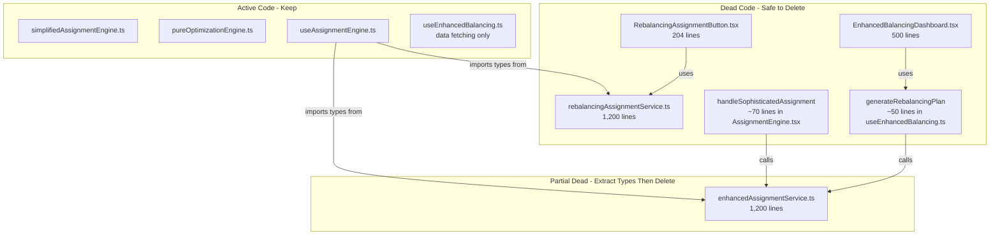

# Dead Assignment Services Cleanup (Revised)

## Summary

Remove two dead assignment services (~2,500 lines) and their unused consumers. These were superseded by `simplifiedAssignmentEngine.ts` but never cleaned up.

## Review Response

This plan was reviewed and revised based on the following findings:

### Accepted Feedback

1. **Missing ParentalAlignmentWarning type** - Fixed: now re-exported from parentalAlignmentService.ts
2. **Cancel logic assessment corrected** - The cancel DOES reset UI state (valuable), just cannot stop LP solver
3. **Type reuse from assignmentService.ts rejected** - The types there are incompatible (different statistics shape)
4. **Dependency order improved** - Added explicit build check BEFORE deleting files
5. **RepMetrics export preserved** - Confirmed: only removing generateRebalancingPlan, not type exports

### Rejected Feedback

1. **"Use assignmentService.ts types"** - Rejected because assignmentService.ts has a different AssignmentResult interface with complex statistics type that is incompatible with how useAssignmentEngine.ts constructs results inline

## Dead Code Map



## What Each File Does (and Why It's Dead)

| File | Lines | Status | Reason |

|------|-------|--------|--------|

| `rebalancingAssignmentService.ts` | ~1,200 | **DELETE** | Never called - `RebalancingAssignmentButton` is never rendered |

| `RebalancingAssignmentButton.tsx` | ~204 | **DELETE** | Never imported or rendered in any page |

| `EnhancedBalancingDashboard.tsx` | ~500 | **DELETE** | Never imported - replaced by `TerritoryBalancingDashboard` |

| `enhancedAssignmentService.ts` | ~1,200 | **DELETE** (after type extraction) | Only used for: (1) types, (2) non-functional cancel, (3) dead `handleSophisticatedAssignment` |

## Detailed Changes

### Phase 1: Create Shared Types File

Create `src/types/assignment.ts` to hold the types currently duplicated in both dead services:

```typescript
/**
 * Assignment Types
 * 
 * Shared types for assignment engine results and progress tracking.
 * These types are used by useAssignmentEngine.ts and AssignmentGenerationDialog.tsx.
 * 
 * NOTE: These are simpler than the types in assignmentService.ts which have
 * a more complex statistics structure. Do not merge them.
 */

// Re-export ParentalAlignmentWarning from its source
export type { ParentalAlignmentWarning } from '@/services/parentalAlignmentService';
import type { ParentalAlignmentWarning } from '@/services/parentalAlignmentService';

export interface AssignmentProposal {
  accountId: string;
  accountName: string;
  currentOwnerId?: string;
  currentOwnerName?: string;
  proposedOwnerId: string;
  proposedOwnerName: string;
  proposedOwnerRegion?: string;
  assignmentReason: string;
  ruleApplied: string;
  conflictRisk: 'LOW' | 'MEDIUM' | 'HIGH';
}

export interface AssignmentResult {
  totalAccounts: number;
  assignedAccounts: number;
  unassignedAccounts: number;
  proposals: AssignmentProposal[];
  conflicts: AssignmentProposal[];
  statistics: any;
  parentalAlignmentWarnings?: ParentalAlignmentWarning[];
}

export interface AssignmentProgress {
  stage: string;
  progress: number;
  status: string;
  currentRule?: string;
  rulesCompleted: number;
  totalRules: number;
  accountsProcessed: number;
  totalAccounts: number;
  assignmentsMade: number;
  conflicts: number;
  error?: string;
}

export type ProgressCallback = (progress: AssignmentProgress) => void;
```

### Phase 2: Update Imports in Active Files

**[useAssignmentEngine.ts](book-ops-workbench/src/hooks/useAssignmentEngine.ts)**

Changes:

1. Change: `import type { AssignmentResult, AssignmentProgress } from '@/services/rebalancingAssignmentService'`

To: `import type { AssignmentResult, AssignmentProgress } from '@/types/assignment'`

2. Remove: `import { RebalancingAssignmentService } from '@/services/rebalancingAssignmentService'` (class never instantiated)

3. Remove: `import { EnhancedAssignmentService } from '@/services/enhancedAssignmentService'` (only used in cancelGeneration)

4. Simplify `cancelGeneration()` function (lines 1383-1397):
```typescript
// BEFORE:
const cancelGeneration = () => {
  try {
    const service = EnhancedAssignmentService.getInstance();
    service.cancelGeneration();
  } catch (error) {
    console.warn('[useAssignmentEngine] Could not cancel service:', error);
  }
  setIsGenerating(false);
  setAssignmentProgress(null);
  toast({
    title: "Generation Cancelled",
    description: "Assignment generation was stopped.",
  });
};

// AFTER:
const cancelGeneration = () => {
  // Note: Cannot cancel in-flight LP solver - this resets UI state only
  setIsGenerating(false);
  setAssignmentProgress(null);
  toast({
    title: "Generation Stopped",
    description: "UI reset. Note: Any in-flight solver will complete in background.",
  });
};
```


**[AssignmentGenerationDialog.tsx](book-ops-workbench/src/components/AssignmentGenerationDialog.tsx)**

Changes:

1. Change: `import type { AssignmentProgress } from '@/services/enhancedAssignmentService'`

To: `import type { AssignmentProgress } from '@/types/assignment'`

2. Remove dead cancel logic in the onCancel handler (~lines 560-567):
```typescript
// BEFORE:
onCancel={() => {
  try {
    const { EnhancedAssignmentService } = require('../services/enhancedAssignmentService');
    const service = EnhancedAssignmentService.getInstance();
    if (service && typeof service.cancelGeneration === 'function') {
      service.cancelGeneration();
    }
  } catch (error) {
    // Silent fail
  }
}}

// AFTER:
// Remove this entire block - the parent component's cancelGeneration handles UI state
```


### Phase 3: Cancel Logic Clarification

**Assessment Correction:** The cancel button IS functional for UX purposes:

- It resets `isGenerating` state (stops UI polling)
- It clears `assignmentProgress` (resets progress display)  
- It shows a toast notification to the user

What it CANNOT do:

- Stop an in-flight HiGHS LP solver (runs synchronously in WASM or on Cloud Run)
- Cancel the `simplifiedAssignmentEngine` mid-execution (no cancellation tokens)

**Decision:** Keep the cancel button with honest messaging. The UI reset is valuable even if the solver continues in background.

The changes are already specified in Phase 2 above.

### Phase 4: Remove Dead Code in useEnhancedBalancing.ts

**[useEnhancedBalancing.ts](book-ops-workbench/src/hooks/useEnhancedBalancing.ts)**

**Verified Safe to Remove:**

- `generateRebalancingPlan` function (~lines 552-593) - Only called by dead `EnhancedBalancingDashboard`
- `rebalancingLoading` state (~line 101) - Only used by `generateRebalancingPlan`
- `import { EnhancedAssignmentService }` (~line 4) - Only used by dead function

**MUST KEEP (actively used):**

- `RepMetrics` interface - Used by `SalesRepDetailModal.tsx`, `BalancingAnalyticsRow.tsx`
- `AccountDetail` type - Used by `ChangeChildOwnerDialog.tsx`, `ParentChildRelationshipDialog.tsx`
- All data fetching logic - Used by `TerritoryBalancingDashboard.tsx`
- Return values: `data`, `isLoading`, `error`, `refetch`

**Changes:**

1. Remove import: `import { EnhancedAssignmentService } from '@/services/enhancedAssignmentService'`
2. Remove state: `const [rebalancingLoading, setRebalancingLoading] = useState(false);`
3. Remove function: `const generateRebalancingPlan = async () => { ... }` (lines 552-593)
4. Update return: Remove `generateRebalancingPlan` from return object
5. Update `isLoading` return: Change `isLoading: isLoading || rebalancingLoading` to `isLoading`

### Phase 5: Remove Dead Code in AssignmentEngine.tsx

**[AssignmentEngine.tsx](book-ops-workbench/src/pages/AssignmentEngine.tsx)**

**Verified Dead Code:**

- `handleSophisticatedAssignment` function (~lines 566-634) - Defined but never called anywhere

**Investigation Needed Before Removal:**

- `sophisticatedAssignmentResult` state - Check if used elsewhere
- `workloadBalanceData` state - Check if used by any active component

**Changes:**

1. Remove: `handleSophisticatedAssignment` function (lines 566-634)
2. If unused, remove: `sophisticatedAssignmentResult` state and setter
3. If unused, remove: `workloadBalanceData` state and setter

### Phase 6: Build Verification (BEFORE Deletion)

```bash
cd book-ops-workbench && npm run build && npm run lint
```

This must pass BEFORE proceeding to file deletion. If it fails, fix the issues first.

### Phase 7: Delete Files

1. Delete `src/services/rebalancingAssignmentService.ts` (~1,200 lines)
2. Delete `src/services/enhancedAssignmentService.ts` (~1,200 lines)
3. Delete `src/components/RebalancingAssignmentButton.tsx` (~204 lines)
4. Delete `src/components/EnhancedBalancingDashboard.tsx` (~500 lines)

### Phase 8: Final Verification

```bash
cd book-ops-workbench && npm run build && npm run lint
```

## Impact

- **Lines removed**: ~2,500
- **Files deleted**: 4
- **Risk**: Low (verified unused via import tracing)
- **Behavior change**: Cancel button message updated to be honest about limitations

## Files Changed Summary

| Action | File | Notes |

|--------|------|-------|

| CREATE | `src/types/assignment.ts` | New shared types file with ParentalAlignmentWarning re-export |

| MODIFY | `src/hooks/useAssignmentEngine.ts` | Update imports, simplify cancelGeneration |

| MODIFY | `src/hooks/useEnhancedBalancing.ts` | Remove generateRebalancingPlan, keep RepMetrics |

| MODIFY | `src/components/AssignmentGenerationDialog.tsx` | Update imports, remove dead cancel code |

| MODIFY | `src/pages/AssignmentEngine.tsx` | Remove handleSophisticatedAssignment |

| DELETE | `src/services/rebalancingAssignmentService.ts` | Dead code (~1,200 lines) |

| DELETE | `src/services/enhancedAssignmentService.ts` | Dead code (~1,200 lines) |

| DELETE | `src/components/RebalancingAssignmentButton.tsx` | Never rendered |

| DELETE | `src/components/EnhancedBalancingDashboard.tsx` | Never imported |

---

## Disagreements with Reviewer

### 1. "Use assignmentService.ts types instead of creating new file"

**Rejected.** The reviewer suggested importing from `assignmentService.ts` which already exports `AssignmentProposal` and `AssignmentResult`. However:

- `assignmentService.ts` has a **different** `AssignmentResult` interface with complex nested `statistics` type
- `useAssignmentEngine.ts` constructs `AssignmentResult` objects inline with `statistics: any`
- Using the `assignmentService.ts` types would require refactoring how results are constructed
- Creating a new simple types file is cleaner and doesn't risk breaking active code

### 2. Assessment of cancel functionality

**Partially accepted.** The reviewer correctly noted that the cancel button DOES reset UI state, which is valuable. However:

- The reviewer's claim that "both dead services DO have checkCancellation() calls in their main loops" is irrelevant because those services are dead
- The actual engine (`simplifiedAssignmentEngine.ts`) does NOT check cancellation
- The fix is to keep the button but update the toast message to be honest

### 3. "Add AssignmentProgress to assignmentService.ts"

**Rejected.** This would:

- Mix concerns (assignmentService.ts is a different service with its own logic)
- Require changes to an active service file unnecessarily
- A dedicated types file is cleaner for shared types used by multiple consumers