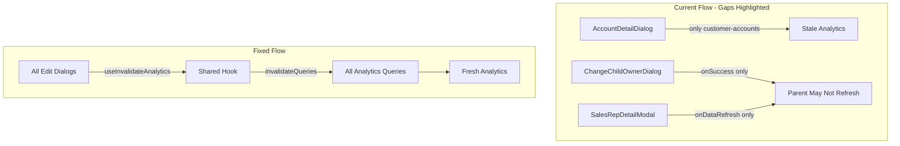

# Fix Analytics Query Invalidation for Manual Edits

## Problem

When users make manual changes in the balancing tab (account reassignments, child owner changes), some components fail to invalidate analytics queries, causing stale data in KPIs and charts.



## Components to Fix

| Component | Issue | Fix |
|-----------|-------|-----|
| [`AccountDetailDialog.tsx`](book-ops-workbench/src/components/AccountDetailDialog.tsx) | Only invalidates `customer-accounts`, not analytics | Use shared invalidation hook |
| [`ChangeChildOwnerDialog.tsx`](book-ops-workbench/src/components/ChangeChildOwnerDialog.tsx) | Only calls `onSuccess?.()`, no direct invalidation | Use shared invalidation hook |
| [`SalesRepDetailModal.tsx`](book-ops-workbench/src/components/SalesRepDetailModal.tsx) | Only calls `onDataRefresh?.()` in reassign handler | Use shared invalidation hook |

## Implementation

### Step 1: Create Shared Invalidation Hook (SSOT)

Create new file [`useInvalidateAnalytics.ts`](book-ops-workbench/src/hooks/useInvalidateAnalytics.ts):

```typescript
import { useQueryClient } from '@tanstack/react-query';

/**
 * Shared hook to invalidate all analytics-related queries after manual edits.
 * 
 * This ensures consistent cache invalidation across all edit dialogs.
 * Query keys use buildId prefix matching - e.g., ['analytics-metrics', buildId]
 * will invalidate ['analytics-metrics', buildId, true] and ['analytics-metrics', buildId, false].
 */
export const useInvalidateAnalytics = () => {
  const queryClient = useQueryClient();
  
  return async (buildId: string) => {
    // Core analytics queries
    await queryClient.invalidateQueries({ queryKey: ['analytics-metrics', buildId] });
    await queryClient.invalidateQueries({ queryKey: ['metrics-comparison', buildId] });
    await queryClient.invalidateQueries({ queryKey: ['enhanced-balancing', buildId] });
    await queryClient.invalidateQueries({ queryKey: ['priority-distribution', buildId] });
    await queryClient.invalidateQueries({ queryKey: ['last-assignment-timestamp', buildId] });
    
    // Rep and account table queries
    await queryClient.invalidateQueries({ queryKey: ['sales-reps-detail', buildId] });
    await queryClient.invalidateQueries({ queryKey: ['sales-reps', buildId] });
  };
};
```

### Step 2: Fix AccountDetailDialog

In [`AccountDetailDialog.tsx`](book-ops-workbench/src/components/AccountDetailDialog.tsx):

**Add import:**
```typescript
import { useInvalidateAnalytics } from '@/hooks/useInvalidateAnalytics';
```

**Inside component:**
```typescript
const invalidateAnalytics = useInvalidateAnalytics();
```

**In handleReassignment (line ~58), replace/add after existing invalidations:**
```typescript
// Existing table invalidations (keep these)
queryClient.invalidateQueries({ queryKey: ['customer-accounts', buildId] });
queryClient.invalidateQueries({ queryKey: ['customer-assignment-changes', buildId] });

// Add analytics invalidation
await invalidateAnalytics(buildId);
```

### Step 3: Fix ChangeChildOwnerDialog

In [`ChangeChildOwnerDialog.tsx`](book-ops-workbench/src/components/ChangeChildOwnerDialog.tsx):

**Add import:**
```typescript
import { useInvalidateAnalytics } from '@/hooks/useInvalidateAnalytics';
```

**Inside component:**
```typescript
const invalidateAnalytics = useInvalidateAnalytics();
```

**In handleChangeOwner (~line 115), after the RPC call and before onSuccess:**
```typescript
// After: await supabase.rpc('update_account_calculated_values', { p_build_id: buildId });

// Invalidate analytics BEFORE calling parent callback
await invalidateAnalytics(buildId);

// Then continue with existing code...
toast({...});
onSuccess?.();
```

### Step 4: Fix SalesRepDetailModal

In [`SalesRepDetailModal.tsx`](book-ops-workbench/src/components/SalesRepDetailModal.tsx):

**Add import:**
```typescript
import { useInvalidateAnalytics } from '@/hooks/useInvalidateAnalytics';
```

**Inside component:**
```typescript
const invalidateAnalytics = useInvalidateAnalytics();
```

**In handleReassign (~line 401), after assignment upsert succeeds:**
```typescript
if (assignmentError) throw assignmentError;

// Invalidate analytics before parent callback
await invalidateAnalytics(buildId);

toast({...});
// Reset state...
onDataRefresh?.();
```

## Technical Notes

### Query Key Prefix Matching

React Query uses prefix matching for invalidation. When we invalidate `['analytics-metrics', buildId]`, it matches:
- `['analytics-metrics', buildId]`
- `['analytics-metrics', buildId, true]`
- `['analytics-metrics', buildId, false]`

This is the correct behavior - we want to invalidate all variants.

### Invalidation Timing

We invalidate BEFORE calling parent callbacks (`onSuccess`, `onDataRefresh`) because:
1. Invalidation marks cache as stale
2. Parent callback may trigger a refetch
3. Refetch gets fresh data (not stale cache)

If we invalidated AFTER the callback, the parent's refetch might serve stale data.

### Duplicate Invalidation (Acceptable)

Some parents may also invalidate queries in their `onDataRefresh` handlers. This is harmless:
- React Query dedupes concurrent invalidations
- The cost is negligible (just marks cache stale)
- The benefit (guaranteed fresh data) outweighs the minor overhead

## Query Keys Reference

From [`useBuildData.ts`](book-ops-workbench/src/hooks/useBuildData.ts):

| Query Key | Used For | Segments |
|-----------|----------|----------|
| `analytics-metrics` | LP success metrics, distributions | `[key, buildId, useProposed]` |
| `metrics-comparison` | Before/after comparison | `[key, buildId]` |
| `enhanced-balancing` | Rep balancing data | `[key, buildId]` |
| `priority-distribution` | Priority breakdown pie chart | `[key, buildId]` |
| `last-assignment-timestamp` | Last assignment time | `[key, buildId]` |
| `sales-reps-detail` | Rep table with aggregates | `[key, buildId, ...]` |

## Testing

After implementation, verify these scenarios:

1. **AccountDetailDialog**: Reassign a high-ARR account
   - Rep's ARR in bar chart should decrease
   - Continuity % should update
   - No manual page refresh required

2. **ChangeChildOwnerDialog**: Change a child account owner
   - Parent account's effective ARR should update
   - Split ownership indicator should appear
   - Rep totals should reflect the change

3. **SalesRepDetailModal**: Bulk reassign multiple accounts
   - Priority pie chart should update
   - Before/after comparison should reflect changes
   - All rep metrics should refresh

---

## Review Disagreements

### Disagreement 1: Invalidation Order with Parent Callbacks

**Reviewer said:** "Invalidation should happen AFTER `onSuccess?.()` is called"

**I disagree:** The standard React Query pattern is to invalidate BEFORE triggering refetches. If we invalidate after `onSuccess`, the parent's refetch (triggered by `onSuccess`) might serve stale cached data because the invalidation hasn't happened yet. The correct order is: invalidate cache → call parent → parent refetches fresh data.

### Disagreement 2: `customer-accounts` Query Key Origin

**Reviewer said:** "Where does `customer-accounts` come from? I don't see these query keys defined anywhere in `useBuildData.ts`. Are these orphaned/dead keys?"

**Response:** These query keys exist in other hooks and components (e.g., CustomerAccountsTable, BeforeAfterTab). They're not orphaned - `useBuildData.ts` is not the only file that defines query keys. The existing invalidations in `AccountDetailDialog` are valid for updating account tables.