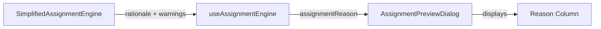

# Fix Assignment Reason Display Bugs

## Problem Summary

The "Reason" column in the assignment preview is showing incorrect/confusing text due to two issues:

1. **Warnings replacing rationale**: When an assignment has warnings (e.g., cross-region), the warning text completely replaces the actual rationale explaining *why* the assignment was made
2. **Redundant text**: Some displays show "Continuity + Geography: Account Continuity + Geography Match (Optimized)" which duplicates information

## Root Cause

In [`useAssignmentEngine.ts`](book-ops-workbench/src/hooks/useAssignmentEngine.ts) lines 753-755:

```typescript
assignmentReason: p.warnings.length > 0 
  ? p.warnings.map(w => `${w.reason}${w.details ? `: ${w.details}` : ''}`).join('; ')
  : p.rationale,
```

When warnings exist, the entire `assignmentReason` is set to warning text instead of the actual rationale.

## Data Flow



## Solution

Modify the proposal transformation in `useAssignmentEngine.ts` to always use the rationale as the primary reason, keeping warnings separate:

**File:** [`book-ops-workbench/src/hooks/useAssignmentEngine.ts`](book-ops-workbench/src/hooks/useAssignmentEngine.ts)

**Change 1:** Fix main proposals mapping (around line 753):
- Always use `p.rationale` as `assignmentReason`
- Keep warnings available but don't replace the rationale

**Change 2:** The conflicts array (lines 770-773) should continue showing warning text since that's appropriate for conflicts view.

The fix is a simple one-liner change replacing the ternary with just `p.rationale`.
