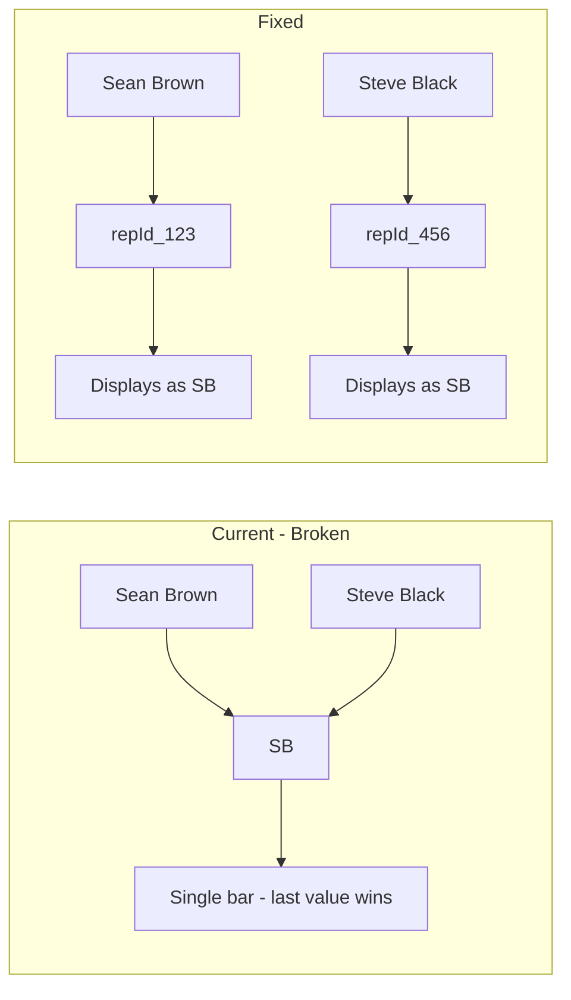

# Fix Duplicate Initials Causing Chart Bar Misplacement

## Problem

In [`RepDistributionChart.tsx`](book-ops-workbench/src/components/analytics/RepDistributionChart.tsx), the Y-axis uses `name` (rep initials like "SB", "MM") as the category key. When two reps share initials:

- Recharts treats them as the same category
- Bars overwrite each other or display in wrong positions
- A $3M rep can appear smaller/below a $530K rep if they share initials



## Solution

Use `repId` (already guaranteed unique) as the Y-axis dataKey, with a `tickFormatter` to display initials. This is cleaner than an index-suffix approach since `repId` is a true identifier.

## Changes

**File: [`book-ops-workbench/src/components/analytics/RepDistributionChart.tsx`](book-ops-workbench/src/components/analytics/RepDistributionChart.tsx)**

1. **Update `chartData` mapping** (line ~267-274): Keep `name` for display, use `repId` as unique key

```typescript
return sorted.map(rep => ({
  ...rep,
  name: formatRepName(rep.repName, rep.repId),  // Display initials (kept for tooltip/legend)
  fullName: rep.repName,
  isSalesTools: isSalesToolsRep(rep.repId, rep.repName),
  isStrategicRep: rep.isStrategicRep ?? false,
  // repId is already in the spread - guaranteed unique for Y-axis
}));
```

2. **Update YAxis** (line ~565-571): Use `repId` as dataKey with formatter lookup

```typescript
<YAxis
  type="category"
  dataKey="repId"  // Guaranteed unique - prevents initials collision
  tick={{ fontSize: 11 }}
  width={40}
  axisLine={false}
  tickLine={false}
  tickFormatter={(repId: string) => {
    // Look up display name from chartData
    const rep = chartData.find(r => r.repId === repId);
    return rep?.name ?? '??';
  }}
/>
```

3. **Add explanatory comment** above YAxis for future maintainers:

```typescript
{/* IMPORTANT: Use repId as dataKey, not name (initials).
    Recharts uses dataKey as category key - if two reps share initials 
    (e.g., "SB" for both "Sean Brown" and "Steve Black"), bars collide.
    tickFormatter displays the initials while repId ensures uniqueness. */}
```

## Why repId Over Index Suffix

| Approach | Pros | Cons |
|----------|------|------|
| `${initials}_${index}` | Simple | Artificial key, requires string parsing |
| `repId` (chosen) | Already unique, semantically correct | Requires lookup in tickFormatter |

The lookup cost is negligible for 30-50 reps.

## Testing

After the fix, verify:

- Bars appear in correct descending order by value
- All reps with duplicate initials show as separate bars
- Tooltips still display full rep name correctly
- Sales Tools row renders correctly (emoji case)
- Strategic reps render with purple styling
- Hover/click on overlapping-initials rows works correctly

## Reviewer Disagreements

None - the reviewer's feedback was incorporated:

1. Agreed: Using `repId` is cleaner than index suffix
2. Agreed: Need to handle Sales Tools emoji case (already works since `name` field is preserved)
3. Agreed: Cell indexing is not affected (uses `chartData.map()` order, not Y-axis key)
4. Agreed: Added comment explaining the Recharts quirk