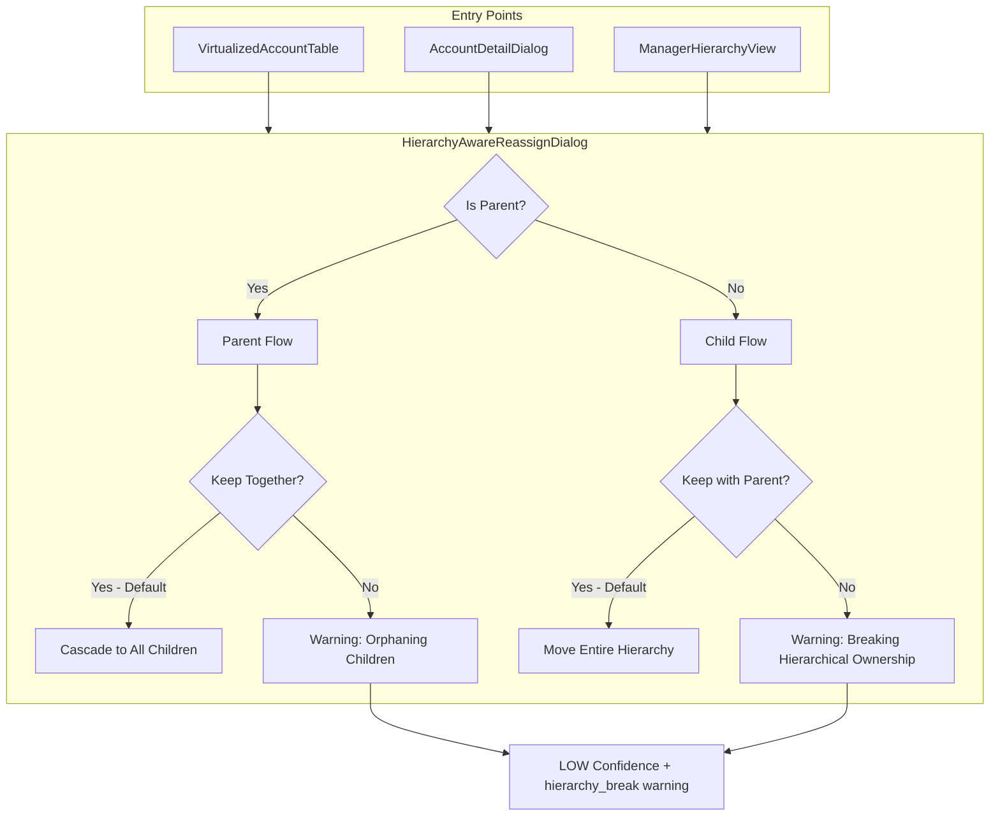

# Hierarchical Ownership Reassignment Feature

## Overview

Create a new `HierarchyAwareReassignDialog` component that intelligently handles parent/child account reassignments. The dialog will:
- Default to keeping parent and children together
- Show warnings when user chooses to break hierarchical ownership
- Mark split assignments with LOW confidence
- Replace existing reassign buttons across all entry points

## Architecture



## Implementation Steps

### Step 1: SSOT Documentation (MASTER_LOGIC.mdc)

Add new section `§13.4.2 Hierarchical Ownership Warnings` to [`book-ops-workbench/src/_domain/MASTER_LOGIC.mdc`](book-ops-workbench/src/_domain/MASTER_LOGIC.mdc):

- Define "Hierarchical Ownership" concept (parent and children share same owner)
- Document warning triggers for breaking hierarchical ownership
- Add `hierarchy_break` warning type with severity: high
- Document UI behavior and confidence impact

### Step 2: Domain Constants (constants.ts)

Update [`book-ops-workbench/src/_domain/constants.ts`](book-ops-workbench/src/_domain/constants.ts):

- Add `HIERARCHY_WARNING_TYPES` constant with `hierarchy_break` definition
- Ensure it integrates with existing `calculateAssignmentConfidence()` function

```typescript
export const HIERARCHY_WARNING_TYPES = {
  HIERARCHY_BREAK: { 
    type: 'hierarchy_break', 
    severity: 'high' as const,
    message: 'Breaking hierarchical ownership - child will have different owner than parent'
  },
} as const;
```

### Step 3: Create HierarchyAwareReassignDialog Component

Create new file [`book-ops-workbench/src/components/HierarchyAwareReassignDialog.tsx`](book-ops-workbench/src/components/HierarchyAwareReassignDialog.tsx):

**Props Interface:**
```typescript
interface HierarchyAwareReassignDialogProps {
  open: boolean;
  onOpenChange: (open: boolean) => void;
  account: Account;
  buildId: string;
  availableReps: Rep[];
  onSuccess?: () => void;
}
```

**Key Features:**
- Detect if account is parent (`!ultimate_parent_id`) or child
- Fetch children count for parent accounts, parent info for child accounts
- Default toggle state: "Keep hierarchy together" = ON
- Show warning panel when toggle is OFF (user wants to split)
- Rep selector with search
- Rationale text input
- Confirmation step for split actions

**UI Sections:**
1. Account info card (name, ARR, parent/child status)
2. Hierarchy info (children count OR parent name)
3. Toggle: "Keep hierarchical ownership" (default: ON)
4. Warning panel (visible when toggle OFF)
5. Rep selector
6. Rationale input
7. Action buttons

### Step 4: Update Entry Point - VirtualizedAccountTable

Modify [`book-ops-workbench/src/components/VirtualizedAccountTable.tsx`](book-ops-workbench/src/components/VirtualizedAccountTable.tsx):

- Import new `HierarchyAwareReassignDialog`
- Add state for dialog open and selected account
- Replace `onReassign(account)` callback with local dialog trigger
- Pass `onSuccess` to refresh data after reassignment

### Step 5: Update Entry Point - AccountDetailDialog

Modify [`book-ops-workbench/src/components/AccountDetailDialog.tsx`](book-ops-workbench/src/components/AccountDetailDialog.tsx):

- Remove inline reassignment logic (the Select + Button)
- Replace with button that opens `HierarchyAwareReassignDialog`
- Pass current account and available reps

### Step 6: Update Entry Point - ManagerHierarchyView

Modify [`book-ops-workbench/src/components/ManagerHierarchyView.tsx`](book-ops-workbench/src/components/ManagerHierarchyView.tsx):

- Replace `reassignAccountMutation` direct calls with dialog trigger
- Import and use `HierarchyAwareReassignDialog`
- Maintain existing approval workflow integration

### Step 7: Database Operations in Dialog

The dialog will handle two scenarios:

**Scenario A: Keep Hierarchy Together (default)**
- Update parent account's `new_owner_id`, `new_owner_name`
- Cascade to all children (respecting `exclude_from_reassignment` locks)
- No warning added, normal confidence

**Scenario B: Break Hierarchical Ownership (toggle OFF)**
- Update only the selected account
- Add `hierarchy_break` warning to assignment record
- Mark as LOW confidence
- Call `mark_split_ownership` RPC
- Show confirmation dialog before executing

### Step 8: Update CHANGELOG.md

Add entry to [`CHANGELOG.md`](CHANGELOG.md):
- Document new feature following SSOT pattern
- List all files changed
- Explain the UX improvement

## Warning Message Copy

**When splitting a CHILD from parent:**
> **Breaking Hierarchical Ownership**
> 
> "{Child Name}" will be assigned to a different owner than its parent "{Parent Name}".
> 
> - This creates "Split Ownership" status
> - Assignment confidence will be marked as LOW
> - Parent's ARR totals will be adjusted
> 
> Are you sure you want to proceed?

**When orphaning CHILDREN from parent:**
> **Breaking Hierarchical Ownership**
> 
> "{Parent Name}" will be reassigned without its {X} child accounts.
> 
> - Children will remain with their current owner(s)
> - This creates "Split Ownership" status
> - Assignment confidence will be marked as LOW
> 
> Are you sure you want to proceed?

## Files Changed Summary

| File | Change Type |
|------|-------------|
| `_domain/MASTER_LOGIC.mdc` | Add §13.4.2 documentation |
| `_domain/constants.ts` | Add `HIERARCHY_WARNING_TYPES` |
| `components/HierarchyAwareReassignDialog.tsx` | New component |
| `components/VirtualizedAccountTable.tsx` | Use new dialog |
| `components/AccountDetailDialog.tsx` | Use new dialog |
| `components/ManagerHierarchyView.tsx` | Use new dialog |
| `CHANGELOG.md` | Document feature |

## Testing Scenarios

1. Reassign parent account (keep together) - children should cascade
2. Reassign parent account (split) - warning shown, parent moves alone, LOW confidence
3. Reassign child account (keep together) - entire hierarchy moves
4. Reassign child account (split) - warning shown, child moves alone, LOW confidence
5. Reassign standalone account (no parent/children) - simple flow, no toggle needed
