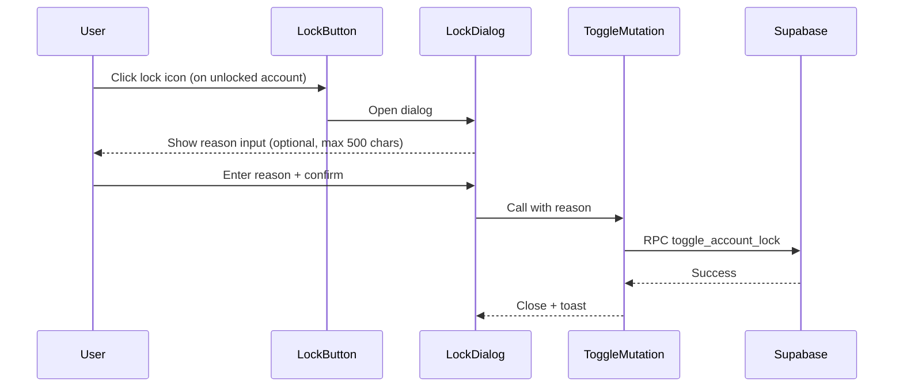

# Locked Account Import with Lock Reason Notes

## Current State

The codebase already has a working lock system:

- **Database column**: `exclude_from_reassignment` (boolean) on `accounts` table
- **Toggle function**: `toggle_account_lock()` RPC in Supabase handles lock/unlock with permissions
- **Stability locks**: [`stabilityLocks.ts`](book-ops-workbench/src/services/optimization/constraints/stabilityLocks.ts) checks `exclude_from_reassignment` first (priority 1) and returns `lockType: 'manual_lock'`
- **UI toggle**: Lock/unlock buttons in [`VirtualizedAccountTable.tsx`](book-ops-workbench/src/components/VirtualizedAccountTable.tsx) and [`AccountsTable.tsx`](book-ops-workbench/src/components/data-tables/AccountsTable.tsx)

## Changes Required

### 1. Database: Add `lock_reason` Column

Add a new nullable text column (with length constraint) to store the lock reason/note:

```sql
-- Migration: add_lock_reason_column.sql

-- 1. Add the column with length constraint
ALTER TABLE accounts ADD COLUMN lock_reason VARCHAR(500);

-- 2. Update the RPC function to accept and clear lock_reason
CREATE OR REPLACE FUNCTION public.toggle_account_lock(
  p_account_id text,
  p_build_id uuid,
  p_is_locking boolean,
  p_owner_id text DEFAULT NULL,
  p_owner_name text DEFAULT NULL,
  p_lock_reason text DEFAULT NULL  -- NEW parameter
)
RETURNS void
LANGUAGE plpgsql
SECURITY DEFINER
SET search_path = public
AS $$
DECLARE
  v_user_role text;
BEGIN
  -- Check user has permission
  SELECT role::text INTO v_user_role
  FROM profiles
  WHERE id = auth.uid();
  
  IF v_user_role NOT IN ('REVOPS', 'FLM', 'SLM') THEN
    RAISE EXCEPTION 'Insufficient permissions to lock/unlock accounts';
  END IF;
  
  IF p_is_locking THEN
    -- Lock: Set exclude flag, copy owner to new_owner, store reason
    UPDATE accounts
    SET 
      exclude_from_reassignment = true,
      new_owner_id = p_owner_id,
      new_owner_name = p_owner_name,
      lock_reason = p_lock_reason  -- NEW: store reason
    WHERE sfdc_account_id = p_account_id
      AND build_id = p_build_id;
      
    -- Create or update assignment record
    -- NOTE: Keep rationale simple "Locked to current owner" - don't include lock_reason
    -- This prevents breaking the DELETE match below
    INSERT INTO assignments (
      sfdc_account_id,
      build_id,
      proposed_owner_id,
      proposed_owner_name,
      rationale,
      assignment_type,
      is_approved,
      created_by
    )
    VALUES (
      p_account_id,
      p_build_id,
      p_owner_id,
      p_owner_name,
      'Locked to current owner',
      'customer',
      true,
      auth.uid()
    )
    ON CONFLICT (sfdc_account_id, build_id)
    DO UPDATE SET
      proposed_owner_id = EXCLUDED.proposed_owner_id,
      proposed_owner_name = EXCLUDED.proposed_owner_name,
      is_approved = true,
      updated_at = now();
  ELSE
    -- Unlock: Clear exclude flag, new_owner fields, AND lock_reason
    UPDATE accounts
    SET 
      exclude_from_reassignment = false,
      new_owner_id = NULL,
      new_owner_name = NULL,
      lock_reason = NULL  -- CRITICAL: Clear reason on unlock!
    WHERE sfdc_account_id = p_account_id
      AND build_id = p_build_id;
      
    -- Delete assignment record for unlocked accounts
    DELETE FROM assignments
    WHERE sfdc_account_id = p_account_id
      AND build_id = p_build_id
      AND rationale = 'Locked to current owner';
  END IF;
END;
$$;
```

### 2. CSV Import: Support `locked` Column

Add field alias mapping in [`autoMappingUtils.ts`](book-ops-workbench/src/utils/autoMappingUtils.ts):

```typescript
// Add to ACCOUNT_FIELD_ALIASES array
{
  schemaField: 'exclude_from_reassignment',
  aliases: [
    'locked', 'Locked', 'lock', 'Lock', 'exclude', 'Exclude',
    'exclude_from_reassignment', 'Exclude From Reassignment',
    'keep_owner', 'Keep Owner', 'do_not_reassign'
  ],
  patterns: [/.*locked.*/i, /.*exclude.*reassign.*/i, /.*keep.*owner.*/i],
  required: false
},
{
  schemaField: 'lock_reason',
  aliases: [
    'lock_reason', 'Lock Reason', 'lock_note', 'Lock Note',
    'exclusion_reason', 'Exclusion Reason', 'lock_notes', 'Lock Notes'
  ],
  patterns: [/.*lock.*reason.*/i, /.*lock.*note.*/i, /.*exclusion.*reason.*/i],
  required: false
}
```

### 3. CSV Import UI: Add to DataImport.tsx Field Mappings

**CRITICAL**: The fields must also be added to the `accountMappings` array in [`DataImport.tsx`](book-ops-workbench/src/pages/DataImport.tsx) so users can see and manually map them:

```typescript
// Add to accountMappings array in DataImport.tsx (secondary priority section)
{ csvField: '', schemaField: 'exclude_from_reassignment', required: false, mapped: false, priority: 'secondary', description: 'Lock account - exclude from reassignment (true/false)' },
{ csvField: '', schemaField: 'lock_reason', required: false, mapped: false, priority: 'secondary', description: 'Reason for locking the account' },
```

### 4. Import Transform: Parse Boolean Values

**CRITICAL**: The field `exclude_from_reassignment` does NOT match the existing boolean detection patterns in [`importUtils.ts`](book-ops-workbench/src/utils/importUtils.ts). Update the boolean detection:

```typescript
// In importUtils.ts around line 265, update the boolean detection condition:
} else if (schemaField.toLowerCase().includes('customer') || 
           (schemaField.toLowerCase().includes('is_') && schemaField !== 'is_parent') ||
           schemaField.toLowerCase().includes('risk') ||
           schemaField === 'exclude_from_reassignment') {  // ADD THIS EXPLICIT CHECK
  // Handle boolean fields
  const lowerValue = rawValue.toString().toLowerCase().trim();
  processedValue = ['true', 'yes', 'y', '1'].includes(lowerValue);
}
```

### 5. UI: Lock Confirmation Dialog

Create a new component [`LockAccountDialog.tsx`](book-ops-workbench/src/components/LockAccountDialog.tsx):



The dialog will:

- Show when locking (not when unlocking - unlock is immediate click)
- Have a textarea for optional lock reason (max 500 characters with counter)
- Confirm/Cancel buttons
- Show account name in header for context

**UX Clarification**: Clicking the lock icon on an **already-locked** account immediately unlocks it (current behavior preserved). To edit the reason on a locked account, user must unlock then re-lock.

### 6. Display Lock Reason in UI (Throughout the Build)

The `lock_reason` will be visible **everywhere a lock icon appears** for accounts:

| Location | File | How Reason is Shown |

|----------|------|---------------------|

| **Assignment Engine** - Account table | `VirtualizedAccountTable.tsx` | Hover tooltip on lock icon |

| **Build Detail** - Data Overview tab | `AccountsTable.tsx` | Hover tooltip on lock icon |

| **Assignment Preview** | Various dialogs | Rationale column shows "Manual lock" (reason in accounts table only) |

Update the lock icon tooltip in both table components:

```tsx
<TooltipContent className="max-w-xs">
  {account.exclude_from_reassignment ? (
    <div className="space-y-1">
      <p className="font-medium">Locked - Account will not be reassigned</p>
      {account.lock_reason ? (
        <p className="text-sm text-muted-foreground italic">"{account.lock_reason}"</p>
      ) : (
        <p className="text-xs text-muted-foreground italic">(no reason provided)</p>
      )}
      <p className="text-xs text-muted-foreground">Click to unlock</p>
    </div>
  ) : (
    <p>Click to lock and keep with current owner</p>
  )}
</TooltipContent>
```

### 7. SSOT Documentation

Update [`MASTER_LOGIC.mdc`](book-ops-workbench/src/_domain/MASTER_LOGIC.mdc) section on stability locks to document the new `lock_reason` field.

Add to §6.6 (Account Flags table):

```markdown
| `lock_reason` | `accounts` | Text note explaining why account is locked (max 500 chars) |
```

Add to §10.5.1 (Manual Holdover section):

```markdown
**Lock Reason**: When locking via UI, users can optionally provide a reason (max 500 chars).
This reason is stored in `accounts.lock_reason` and displayed on hover over the lock icon.
The reason is cleared when the account is unlocked.
```

## Files to Modify

| File | Change |

|------|--------|

| `supabase/migrations/YYYYMMDD_add_lock_reason.sql` | Add `lock_reason` column, update `toggle_account_lock()` |

| `src/integrations/supabase/types.ts` | Regenerate types (add `lock_reason`, update RPC params) |

| `src/utils/autoMappingUtils.ts` | Add `exclude_from_reassignment` and `lock_reason` field aliases |

| `src/pages/DataImport.tsx` | Add both fields to `accountMappings` array |

| `src/utils/importUtils.ts` | Add `exclude_from_reassignment` to boolean detection |

| `src/components/LockAccountDialog.tsx` | **New file** - Lock confirmation dialog with reason textarea |

| `src/components/VirtualizedAccountTable.tsx` | Use dialog on lock, show reason in tooltip |

| `src/components/data-tables/AccountsTable.tsx` | Same changes as VirtualizedAccountTable |

| `src/_domain/MASTER_LOGIC.mdc` | Document `lock_reason` field in §6.6 and §10.5.1 |

| `CHANGELOG.md` | Document feature |

---

## Review Response

### Points Agreed With (Incorporated Above)

1. **Missing DataImport.tsx field mappings** - Correct. Added step 3 explicitly.
2. **Boolean parsing won't catch the field** - Correct. Added explicit check in step 4.
3. **lock_reason not cleared on unlock** - Correct. Added to migration in step 1.
4. **Assignment rationale string matching** - Correct. Kept simple "Locked to current owner" rationale.
5. **VARCHAR(500) constraint** - Correct. Added to migration and noted in dialog component.
6. **Edit-reason UX** - Clarified: unlock-then-relock pattern preserved.
7. **Null reason display** - Added "(no reason provided)" in italic for null reasons.

### Points Disagreed With

None. The reviewer's analysis was thorough and all critical issues were valid. The plan has been updated to address every point raised.