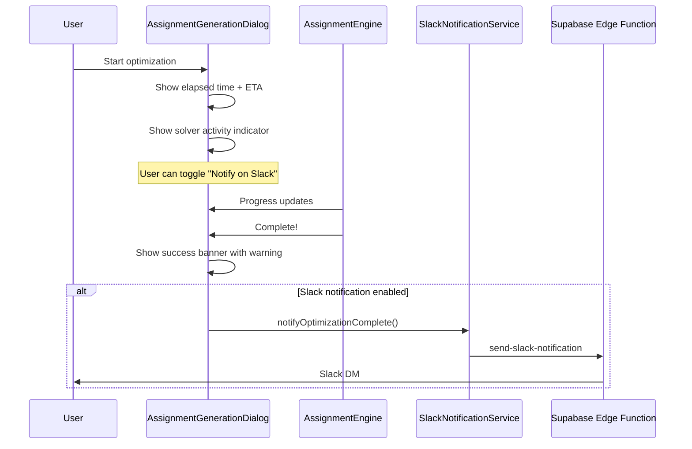

# Optimization Progress UX Improvements

Improve transparency and user experience for long-running optimization processes (typically 5-6 minutes for large datasets).

## Overview

Add three key features:

1. Benchmark-based time estimation (35K accounts = ~6 min)
2. Completion success banner with "don't close" warning
3. Optional Slack notification when optimization completes

## Architecture



## Implementation

### 1. Update AssignmentGenerationDialog.tsx

**File:** [`book-ops-workbench/src/components/AssignmentGenerationDialog.tsx`](book-ops-workbench/src/components/AssignmentGenerationDialog.tsx)

- Add benchmark-based time estimation constants:
  - 35K accounts = 6 minutes baseline
  - Show "Est. Total" initially, switch to "Est. Remaining" as progress advances
- Add completion success banner with amber warning about not closing tab
- Add checkbox for "Notify me on Slack when complete" (persisted to localStorage)
- Pass callback prop `onComplete` to trigger Slack notification

### 2. Add Slack notification helper

**File:** [`book-ops-workbench/src/services/slackNotificationService.ts`](book-ops-workbench/src/services/slackNotificationService.ts)

Add new helper function:

```typescript
export async function notifyOptimizationComplete(
  recipientEmail: string,
  buildName: string,
  accountCount: number,
  proposalCount: number,
  elapsedTime: string
): Promise<NotificationResult>
```

Uses existing `build_status` notification type - no edge function changes needed.

### 3. Wire up Slack notification on completion

**File:** [`book-ops-workbench/src/pages/AssignmentEngine.tsx`](book-ops-workbench/src/pages/AssignmentEngine.tsx)

In `onGenerateAssignments` function (~line 670), after successful completion:

- Read localStorage preference for Slack notification
- If enabled, call `notifyOptimizationComplete()` with user email from AuthContext
- Include build name, account count, proposal count, and elapsed time

### 4. Update edge function notification types (optional)

**File:** [`book-ops-workbench/supabase/functions/send-slack-notification/index.ts`](book-ops-workbench/supabase/functions/send-slack-notification/index.ts)

Add `optimization_complete` to the type union for cleaner semantics (optional - can reuse `build_status`).

## Key UX Details

| Feature | Behavior |

|---------|----------|

| Time estimation | Shows "Est. Total: ~5-8 min" at start, then "Est. Remaining: ~2-5 min" as progress advances |

| Completion banner | Green success with amber warning: "Don't close this tab! Assignments are not saved until you click Apply" |

| Slack checkbox | Only appears for large datasets (>500 accounts), preference saved to localStorage |

| Slack message | Includes proposal count, elapsed time, and reminder to apply assignments |