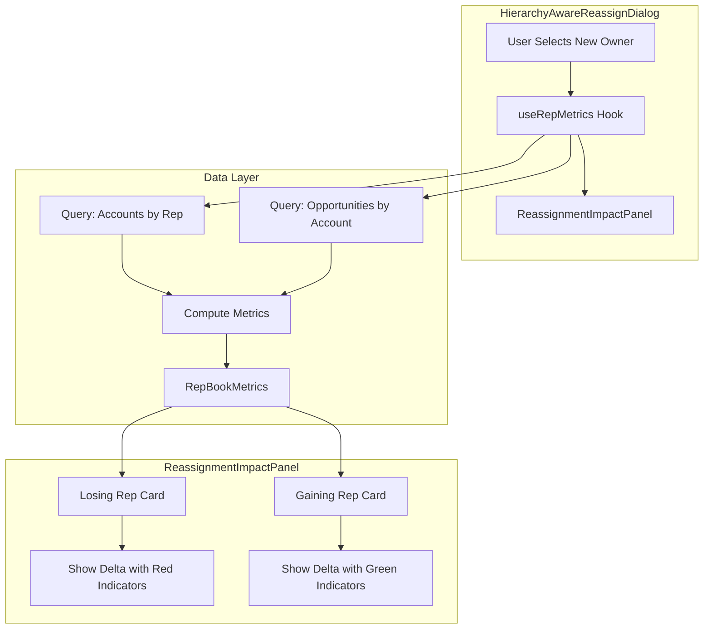

# Reassignment Impact Panel - Full Metrics Display

## Goal

When a user manually reassigns an account, show comprehensive before/after metrics for **both** the losing rep and gaining rep. This gives users the same visibility as the assignment engine provides, enabling informed decisions.

## Metrics to Display (Per Rep)

| Metric | Source | Display |
|--------|--------|---------|
| Account Count | Count of parent accounts | `12 → 11` |
| ARR | Sum via `getAccountARR()` | `$1.2M → $900K` |
| ATR | Sum via `getAccountATR()` | `$400K → $300K` |
| Pipeline | Sum via opportunity data | `$500K → $400K` |
| Tier Breakdown | Count by `expansion_tier` | `T1: 3, T2: 5, T3: 4` |
| Geo Alignment | Check rep.region vs account territory | Checkmark or X icon |
| CRE Risk | Sum of `cre_count` | Badge with count |

---

## Architecture



---

## Implementation Plan

### Step 1: Define RepBookMetrics Type in Domain

Add to [`_domain/calculations.ts`](book-ops-workbench/src/_domain/calculations.ts):

```typescript
export interface RepBookMetrics {
  accountCount: number;
  customerCount: number;
  prospectCount: number;
  totalARR: number;
  totalATR: number;
  totalPipeline: number;
  tierBreakdown: {
    tier1: number;
    tier2: number;
    tier3: number;
    tier4: number;
    unclassified: number;
  };
  creRiskCount: number;
}
```

Also add a pure function to calculate metrics from accounts array:

```typescript
export function calculateRepBookMetrics(
  accounts: AccountData[],
  opportunities: OpportunityData[]
): RepBookMetrics
```

This follows SSOT - the calculation logic lives in `@/_domain`.

### Step 2: Create useRepMetrics Hook

Create [`hooks/useRepMetrics.ts`](book-ops-workbench/src/hooks/useRepMetrics.ts):

```typescript
export function useRepMetrics(
  repId: string | null,
  buildId: string
): {
  metrics: RepBookMetrics | null;
  isLoading: boolean;
}
```

This hook:
- Uses React Query to fetch accounts where `new_owner_id = repId` (or `owner_id` if no proposal)
- Fetches opportunities for those accounts
- Calls `calculateRepBookMetrics()` from `@/_domain`
- Caches results with query key `['rep-metrics', buildId, repId]`

### Step 3: Create ReassignmentImpactPanel Component

Create [`components/ReassignmentImpactPanel.tsx`](book-ops-workbench/src/components/ReassignmentImpactPanel.tsx):

**Props:**
```typescript
interface ReassignmentImpactPanelProps {
  losingRep: { id: string; name: string; region?: string };
  gainingRep: { id: string; name: string; region?: string };
  accountBeingMoved: Account;
  accountsAffectedCount: number; // 1 for standalone, 1+children for hierarchy
  buildId: string;
}
```

**Layout (side-by-side cards):**

```
┌────────────────────────────────────┐  ┌────────────────────────────────────┐
│  LOSING: John Smith                │  │  GAINING: Jane Doe                 │
│  (Current Owner)                   │  │  (New Owner)                       │
├────────────────────────────────────┤  ├────────────────────────────────────┤
│  Accounts:  12 → 11    ▼ -1        │  │  Accounts:  8 → 9      ▲ +1        │
│  ARR:       $1.2M → $900K  ▼ -25%  │  │  ARR:       $800K → $1.1M  ▲ +38%  │
│  ATR:       $400K → $300K  ▼ -25%  │  │  ATR:       $200K → $300K  ▲ +50%  │
│  Pipeline:  $500K → $400K  ▼ -20%  │  │  Pipeline:  $300K → $400K  ▲ +33%  │
├────────────────────────────────────┤  ├────────────────────────────────────┤
│  Tiers: T1:3 T2:5 T3:4 T4:0        │  │  Tiers: T1:2 T2:3 T3:2 T4:1        │
│  CRE Risk: 2 accounts              │  │  CRE Risk: 1 account               │
│  Geo: ✓ Region match               │  │  Geo: ✗ Cross-region               │
└────────────────────────────────────┘  └────────────────────────────────────┘
```

**Key features:**
- Red color scheme for losing rep (things getting smaller)
- Green color scheme for gaining rep (things getting bigger)
- Checkmark/X for geo alignment check
- Badge for CRE risk count
- Compact tier display

### Step 4: Integrate into HierarchyAwareReassignDialog

Modify [`HierarchyAwareReassignDialog.tsx`](book-ops-workbench/src/components/HierarchyAwareReassignDialog.tsx):

1. Import `ReassignmentImpactPanel` and `useRepMetrics`

2. Add hook calls:
```typescript
const currentOwnerId = account?.new_owner_id || account?.owner_id;
const { metrics: losingMetrics } = useRepMetrics(currentOwnerId, buildId);
const { metrics: gainingMetrics } = useRepMetrics(newOwnerId || null, buildId);
```

3. Add panel after owner selection (around line 560, before Rationale):
```tsx
{newOwnerId && currentOwnerId && (
  <ReassignmentImpactPanel
    losingRep={{
      id: currentOwnerId,
      name: account.new_owner_name || account.owner_name || 'Current Owner',
      region: losingRepRegion
    }}
    gainingRep={{
      id: newOwnerId,
      name: selectedRepName || 'New Owner',
      region: selectedRep?.region
    }}
    accountBeingMoved={account}
    accountsAffectedCount={accountsAffected}
    buildId={buildId}
  />
)}
```

### Step 5: Handle Edge Cases

- **Unassigned accounts**: If `currentOwnerId` is null, show "Previously Unassigned" instead of losing rep card
- **Hierarchy cascade**: When `includeChildren` is true, calculate impact including all children's metrics
- **Locked children**: When children are locked, exclude their metrics from the cascade impact

---

## Files Changed

| File | Type | Changes |
|------|------|---------|
| [`_domain/calculations.ts`](book-ops-workbench/src/_domain/calculations.ts) | Edit | Add `RepBookMetrics` interface and `calculateRepBookMetrics()` function |
| [`_domain/index.ts`](book-ops-workbench/src/_domain/index.ts) | Edit | Export new types/functions |
| [`hooks/useRepMetrics.ts`](book-ops-workbench/src/hooks/useRepMetrics.ts) | New | Hook for fetching and computing rep metrics |
| [`components/ReassignmentImpactPanel.tsx`](book-ops-workbench/src/components/ReassignmentImpactPanel.tsx) | New | Side-by-side impact display component |
| [`components/HierarchyAwareReassignDialog.tsx`](book-ops-workbench/src/components/HierarchyAwareReassignDialog.tsx) | Edit | Integrate panel after owner selection |
| `CHANGELOG.md` | Edit | Document feature |

---

## SSOT Compliance

All metric calculations use existing `@/_domain` functions:
- `getAccountARR()` - ARR calculation
- `getAccountATR()` - ATR calculation  
- `getAccountExpansionTier()` - Tier classification
- `getCRERiskLevel()` - CRE risk assessment
- `calculateGeoMatchScore()` - Geo alignment check

The new `calculateRepBookMetrics()` function aggregates these, keeping logic centralized.

---

## Query Efficiency

The `useRepMetrics` hook makes 2 queries per rep:
1. Accounts query (filtered by owner)
2. Opportunities query (filtered by account IDs)

With React Query caching, these are deduplicated across renders. The gaining rep query only fires when `newOwnerId` changes.

For the losing rep, we could potentially reuse data from the hierarchy info fetch, but keeping it separate ensures consistency and simplifies the implementation.

---

## Testing Scenarios

1. **Standalone account reassignment** - Single account, simple metrics delta
2. **Parent with children (cascade)** - Impact includes all children's metrics
3. **Child account (split)** - Only child's metrics move
4. **Unassigned account** - No "losing rep" to show
5. **Cross-region assignment** - Geo alignment shows X
6. **High CRE risk account** - CRE badge updates appropriately
