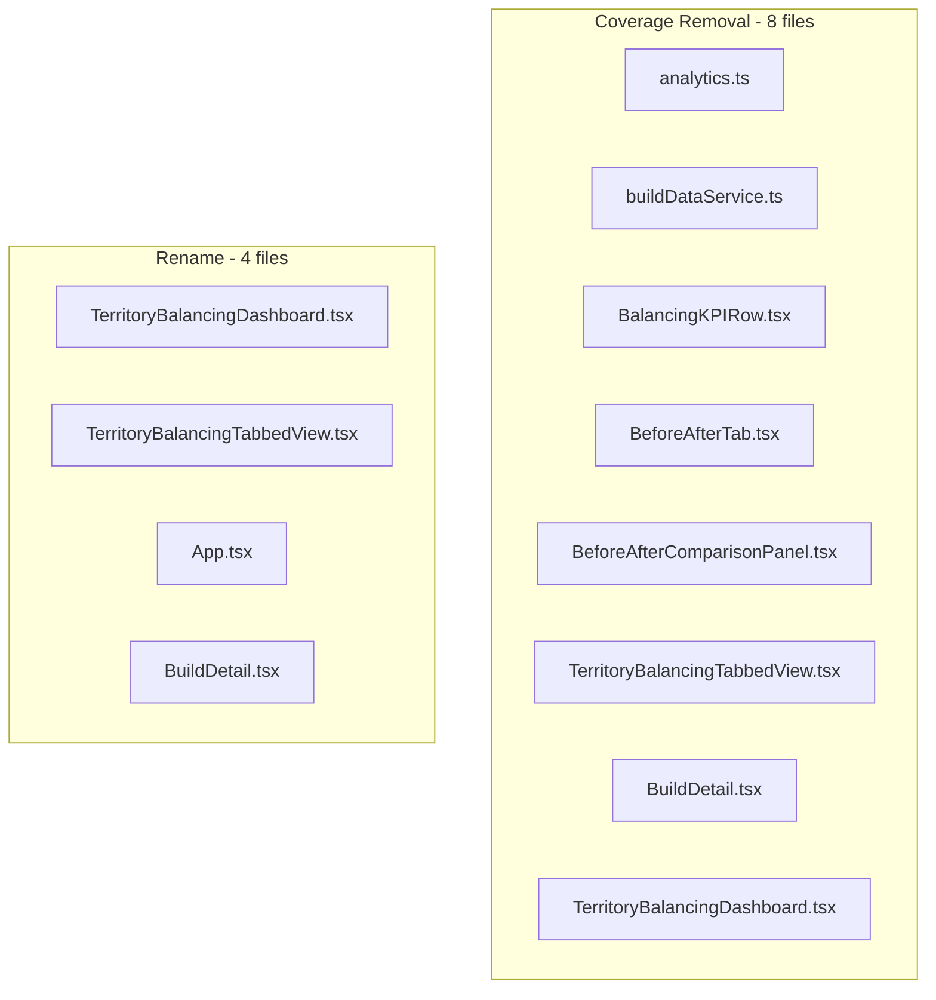

# Remove Coverage Metric + Rename TerritoryBalancing to BookBalancing

## Overview

This plan has two parts:
1. **Remove Coverage metrics** - Delete the "Coverage" metric (% of accounts with owners) from all UI and services
2. **Rename TerritoryBalancing to BookBalancing** - Full rename of files, components, interfaces, and references

No database changes required.

## Scope Analysis



---

## Part 1: Remove Coverage Metric

### 1.1 Remove Type Definition

**File:** [`book-ops-workbench/src/types/analytics.ts`](book-ops-workbench/src/types/analytics.ts)

- Delete the `OwnerCoverage` interface (lines 258-267):
  ```typescript
  // DELETE THIS ENTIRE INTERFACE
  export interface OwnerCoverage {
    withOwner: number;
    orphaned: number;
    coverageRate: number;
  }
  ```
- Remove `ownerCoverage: OwnerCoverage` from `MetricsSnapshot` interface (line 297)

### 1.2 Remove Service Logic

**File:** [`book-ops-workbench/src/services/buildDataService.ts`](book-ops-workbench/src/services/buildDataService.ts)

- Remove `OwnerCoverage` from the imports at line 12
- Delete the entire `calculateOwnerCoverage()` method (lines 1280-1304)
- Remove the `ownerCoverage` property from `calculateMetricsSnapshot()` return object (line 1640)

### 1.3 Update BalancingKPIRow Component

**File:** [`book-ops-workbench/src/components/balancing/BalancingKPIRow.tsx`](book-ops-workbench/src/components/balancing/BalancingKPIRow.tsx)

Changes:
1. Remove from props interface:
   - `coveragePercent: number`
   - `assignedAccounts?: number`
   - `unassignedAccounts?: number`

2. Remove from component destructuring

3. Change grid layout:
   - `grid-cols-2 md:grid-cols-4` → `grid-cols-1 md:grid-cols-3`

4. Fix loading skeleton:
   - `[...Array(4)]` → `[...Array(3)]`

5. Delete the entire "Coverage" Card block (lines 196-236)

6. Remove `UserCheck` icon from imports (no longer used)

### 1.4 Update BeforeAfterTab Component

**File:** [`book-ops-workbench/src/components/balancing/BeforeAfterTab.tsx`](book-ops-workbench/src/components/balancing/BeforeAfterTab.tsx)

- Delete the "Coverage" SuccessMetricTile block (lines 231-254)
- Remove `Users` from icon imports if no longer used elsewhere in file
- Update comment on line 21: Remove "Coverage" from the list

### 1.5 Update BeforeAfterComparisonPanel

**File:** [`book-ops-workbench/src/components/BeforeAfterComparisonPanel.tsx`](book-ops-workbench/src/components/BeforeAfterComparisonPanel.tsx)

- Delete the Coverage Card block (lines 281-292)

### 1.6 Update BuildDetail Page

**File:** [`book-ops-workbench/src/pages/BuildDetail.tsx`](book-ops-workbench/src/pages/BuildDetail.tsx)

- Delete the "Coverage Card" section (lines 580-602)
- Update comment on line 530: `{/* Row 2: Pipeline, Team, Coverage, Team Fit */}` → `{/* Row 2: Pipeline, Team, Team Fit */}`
- Remove `UserCheck` from imports if no longer used

### 1.7 Update TerritoryBalancingDashboard Page

**File:** [`book-ops-workbench/src/pages/TerritoryBalancingDashboard.tsx`](book-ops-workbench/src/pages/TerritoryBalancingDashboard.tsx)

- Remove `coveragePercent` calculation (lines 104-106)
- Remove `coveragePercent` from `kpiData` object (line 115)
- Remove `coveragePercent`, `assignedAccounts`, `unassignedAccounts` props from `BalancingKPIRow` (line 365)

### 1.8 Update TerritoryBalancingTabbedView

**File:** [`book-ops-workbench/src/components/TerritoryBalancingTabbedView.tsx`](book-ops-workbench/src/components/TerritoryBalancingTabbedView.tsx)

- Delete the "Coverage Rate" Card block (lines 773-785) - this shows "% of reps with accounts"
- Note: This is a different metric than OwnerCoverage but user confirmed it should be removed too

---

## Part 2: Rename TerritoryBalancing to BookBalancing

### 2.1 Rename Files

| Old Name | New Name |
|----------|----------|
| `src/pages/TerritoryBalancingDashboard.tsx` | `src/pages/BookBalancingDashboard.tsx` |
| `src/components/TerritoryBalancingTabbedView.tsx` | `src/components/BookBalancingTabbedView.tsx` |

### 2.2 Update Component Names and Interfaces

**In BookBalancingDashboard.tsx (formerly TerritoryBalancingDashboard.tsx):**
- `TerritoryBalancingDashboardProps` → `BookBalancingDashboardProps`
- `TerritoryBalancingDashboard` → `BookBalancingDashboard`
- Update default export

**In BookBalancingTabbedView.tsx (formerly TerritoryBalancingTabbedView.tsx):**
- `TerritoryBalancingTabbedViewProps` → `BookBalancingTabbedViewProps`
- `TerritoryBalancingTabbedView` → `BookBalancingTabbedView`

### 2.3 Update Imports

**File:** [`book-ops-workbench/src/App.tsx`](book-ops-workbench/src/App.tsx)

```typescript
// OLD
import TerritoryBalancingDashboard from "./pages/TerritoryBalancingDashboard";

// NEW
import BookBalancingDashboard from "./pages/BookBalancingDashboard";
```

**File:** [`book-ops-workbench/src/pages/BuildDetail.tsx`](book-ops-workbench/src/pages/BuildDetail.tsx)

```typescript
// OLD
import TerritoryBalancingDashboard from './TerritoryBalancingDashboard';
// ... later ...
<TerritoryBalancingDashboard buildId={id!} />

// NEW
import BookBalancingDashboard from './BookBalancingDashboard';
// ... later ...
<BookBalancingDashboard buildId={id!} />
```

**In BookBalancingDashboard.tsx:**
```typescript
// OLD
import { TerritoryBalancingTabbedView } from '@/components/TerritoryBalancingTabbedView';

// NEW
import { BookBalancingTabbedView } from '@/components/BookBalancingTabbedView';
```

---

## Files NOT Modified

| File | Reason |
|------|--------|
| `simplifiedAssignmentEngine.ts` | "global coverage" comment refers to rep geography, unrelated |
| `autoMappingUtils.ts` | "coverage_territory" is a column alias for imports, unrelated |
| `BalancingSuccessMetrics.tsx` | "efficient coverage" is descriptive text in tooltip, unrelated |
| `RevOpsFinalView.tsx` | "coverage-check" tab is a different feature (cross-build account check), unrelated |
| `MASTER_LOGIC.mdc` | No `OwnerCoverage` references exist - "coverage-focused" refers to geographic coverage |

---

## Verification Steps

After all changes:

```bash
cd book-ops-workbench

# 1. TypeScript compilation check
npm run build

# 2. Linter check
npm run lint

# 3. Grep verification - should return no results
grep -rn "ownerCoverage\|OwnerCoverage\|coveragePercent\|coverageRate" src/
grep -rn "TerritoryBalancing" src/
```

---

## Order of Operations

1. **Types first** - Delete `OwnerCoverage` interface
2. **Service second** - Remove `calculateOwnerCoverage` method
3. **Run `tsc --noEmit`** - This will show all broken references at once
4. **Fix all consumer files** - Components and pages
5. **Rename files** - Dashboard and TabbedView
6. **Update imports** - App.tsx and BuildDetail.tsx
7. **Final verification** - `npm run build` and `npm run lint`

---

## Disagreements with Review

### Agreed With (incorporated above):
- Grid layout changes need to be explicit (skeleton array, mobile cols)
- Import cleanup should be explicit per file
- Add `npm run build` verification step
- Add grep verification at end
- Better order of operations (types → compile check → fix all)
- Explicit exclusion of RevOpsFinalView.tsx with reasoning
- TerritoryBalancingTabbedView.tsx "Coverage Rate" should be addressed (user confirmed: remove it)

### Disagreed With:
1. **"MASTER_LOGIC.mdc may need updates"** - Verified there are no `OwnerCoverage` references. The "coverage" mentions are about geographic coverage, not this metric. No changes needed.

2. **"BeforeAfterTab grid layout unclear"** - Verified the component uses a simple flexbox with `flex flex-wrap`, not a strict grid. Removing one tile will naturally reflow. No grid changes needed.