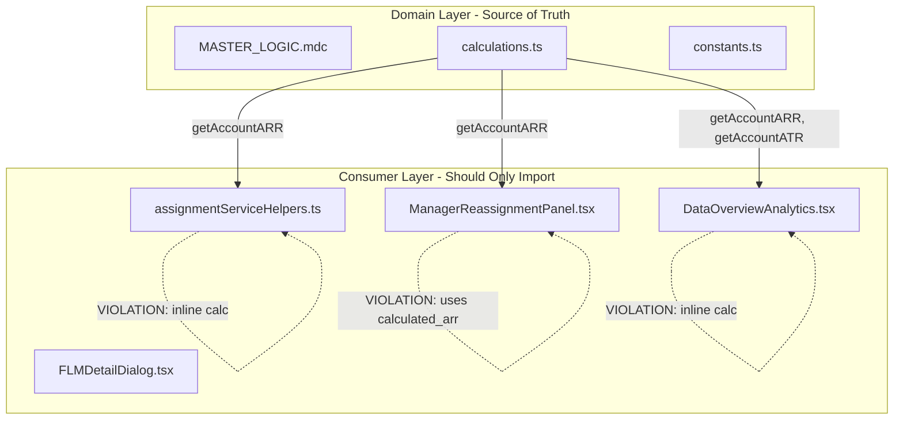

# SSOT Violation Bug Fixes

This plan addresses 4 bugs found during the post-change audit. All involve inline calculations that should use functions from `@/_domain`.

---

## Architecture Context

The violations are all in the **Consumer Layer** - these files should only IMPORT business logic, not define it:



---

## Bug #1: assignmentServiceHelpers.ts (HIGH Priority)

**File:** [`src/services/assignmentServiceHelpers.ts`](book-ops-workbench/src/services/assignmentServiceHelpers.ts)

**Problem:** The `getHierarchyTotalARR()` function (lines 154-170) uses inline ARR calculation instead of the SSOT function.

**Current Code (line 167):**
```typescript
const arr = acc.hierarchy_bookings_arr_converted || acc.calculated_arr || acc.arr || 0;
```

**Fix Required:**
1. Add import at top of file:
```typescript
import { getAccountARR } from '@/_domain';
```

2. Replace line 167 with:
```typescript
const arr = getAccountARR(acc);
```

**Why This Matters:** If the ARR priority chain changes in `MASTER_LOGIC.mdc`, this inline code would be stale. Using the domain function ensures consistency.

---

## Bug #2: ManagerReassignmentPanel.tsx (HIGH Priority)

**File:** [`src/components/ManagerReassignmentPanel.tsx`](book-ops-workbench/src/components/ManagerReassignmentPanel.tsx)

**Problem:** Line 281 uses `selectedAccountData.calculated_arr || 0` but the file already imports `getAccountARR` on line 5 - it just doesn't use it here!

**Current Code (line 281):**
```typescript
ARR: {new Intl.NumberFormat('en-US', { style: 'currency', currency: 'USD', minimumFractionDigits: 0 }).format(selectedAccountData.calculated_arr || 0)}
```

**Fix Required:**
Replace `selectedAccountData.calculated_arr || 0` with `getAccountARR(selectedAccountData)`:
```typescript
ARR: {new Intl.NumberFormat('en-US', { style: 'currency', currency: 'USD', minimumFractionDigits: 0 }).format(getAccountARR(selectedAccountData))}
```

**Why This Matters:** This skips `hierarchy_bookings_arr_converted` which should be checked first per MASTER_LOGIC.mdc section 2.1.

---

## Bug #3: DataOverviewAnalytics.tsx (MEDIUM Priority)

**File:** [`src/components/DataOverviewAnalytics.tsx`](book-ops-workbench/src/components/DataOverviewAnalytics.tsx)

**Problem:** Lines 145-146 use inline ARR/ATR calculations for orphaned children metrics, AND the Supabase query (line 121) is missing `hierarchy_bookings_arr_converted` which is required for correct ARR priority chain.

**Current Code (line 121 - Supabase query):**
```typescript
.select('sfdc_account_id, calculated_arr, arr, calculated_atr, ultimate_parent_id')
```

**Current Code (lines 145-146 - inline calculation):**
```typescript
const orphanARR = orphanedChildren.reduce((sum, a) => sum + (a.calculated_arr ?? a.arr ?? 0), 0);
const orphanATR = orphanedChildren.reduce((sum, a) => sum + (a.calculated_atr ?? 0), 0);
```

**Issues:**
- Supabase query missing `hierarchy_bookings_arr_converted` field
- ARR calculation is missing `hierarchy_bookings_arr_converted` (wrong priority chain)
- ATR calculation should use `getAccountATR()` for consistency

**Fix Required:**

1. Update import on line 15:
```typescript
import { formatCurrency, getAccountARR, getAccountATR } from '@/_domain';
```

2. Update Supabase query on line 121 to include missing field:
```typescript
.select('sfdc_account_id, hierarchy_bookings_arr_converted, calculated_arr, arr, calculated_atr, ultimate_parent_id')
```

3. Replace lines 145-146:
```typescript
const orphanARR = orphanedChildren.reduce((sum, a) => sum + getAccountARR(a), 0);
const orphanATR = orphanedChildren.reduce((sum, a) => sum + getAccountATR(a), 0);
```

**Why the query update matters:** Without `hierarchy_bookings_arr_converted` in the select, `getAccountARR()` would always skip the first priority in the chain, making it no better than the inline calculation.

---

## Bug #4: FLMDetailDialog.tsx (LOW Priority - Lint Fix)

**File:** [`src/components/FLMDetailDialog.tsx`](book-ops-workbench/src/components/FLMDetailDialog.tsx)

**Problem:** Line 282 uses `let` when `const` should be used (linter error).

**Current Code:**
```typescript
let childrenByParent = ...
```

**Fix Required:**
```typescript
const childrenByParent = ...
```

---

## Testing Verification

After fixes, verify:
1. Run `npm run lint` - should have fewer errors
2. No runtime errors in:
   - Manager Reassignment Panel (test reassigning an account)
   - Data Overview Analytics (check orphan account stats)
   - Hierarchy-aware reassignment (cascade to children)

---

## Changelog Entry

Add to CHANGELOG.md:

```markdown
## [2025-12-22] - Fix: SSOT Violations from Post-Change Audit

**Summary:** Fixed 4 SSOT violations discovered during codebase audit. All inline ARR/ATR calculations replaced with proper `@/_domain` imports.

| File | Issue | Fix |
|------|-------|-----|
| `assignmentServiceHelpers.ts:167` | Inline ARR calculation | Use `getAccountARR()` |
| `ManagerReassignmentPanel.tsx:281` | Used `calculated_arr` directly | Use `getAccountARR()` (already imported) |
| `DataOverviewAnalytics.tsx:121` | Missing `hierarchy_bookings_arr_converted` in query | Added field to Supabase `.select()` |
| `DataOverviewAnalytics.tsx:145-146` | Inline ARR/ATR with wrong priority | Use `getAccountARR()`, `getAccountATR()` |
| `FLMDetailDialog.tsx:282` | `let` should be `const` | Changed to `const` |

### References
- MASTER_LOGIC.mdc section 2.1 (ARR Priority Chain)
- MASTER_LOGIC.mdc section 2.2 (ATR Calculation)
```

---

## Review Disagreements

The following suggestions from the review were considered but NOT adopted:

### 1. Type Safety Concerns (Bug #1)

**Reviewer suggested:** Add `@ts-expect-error` or explicit type casting for the Supabase result.

**Why rejected:** The `AccountData` interface in `calculations.ts` defines all fields as optional (`?`). The Supabase query result `{hierarchy_bookings_arr_converted, calculated_arr, arr}` is structurally compatible with `AccountData` - TypeScript will not error. Adding `@ts-expect-error` would be misleading since there is no error to suppress.

### 2. Implementation Order Change

**Reviewer suggested:** Reorder fixes to start with Bug #4 (safest) first.

**Why rejected:** All 4 fixes are independent and low-risk. The current order (by severity) is more logical for documentation and review purposes. Execution order is arbitrary when changes don't depend on each other.

### 3. "Accept the limitation" Option for Bug #3

**Reviewer suggested:** Option 2 would be to accept the limitation and not add `hierarchy_bookings_arr_converted` to the query.

**Why rejected:** This violates SSOT principles. If we're going to use `getAccountARR()`, we must provide it the data it needs. Half-measures create the same fragility the SSOT pattern is designed to prevent.
