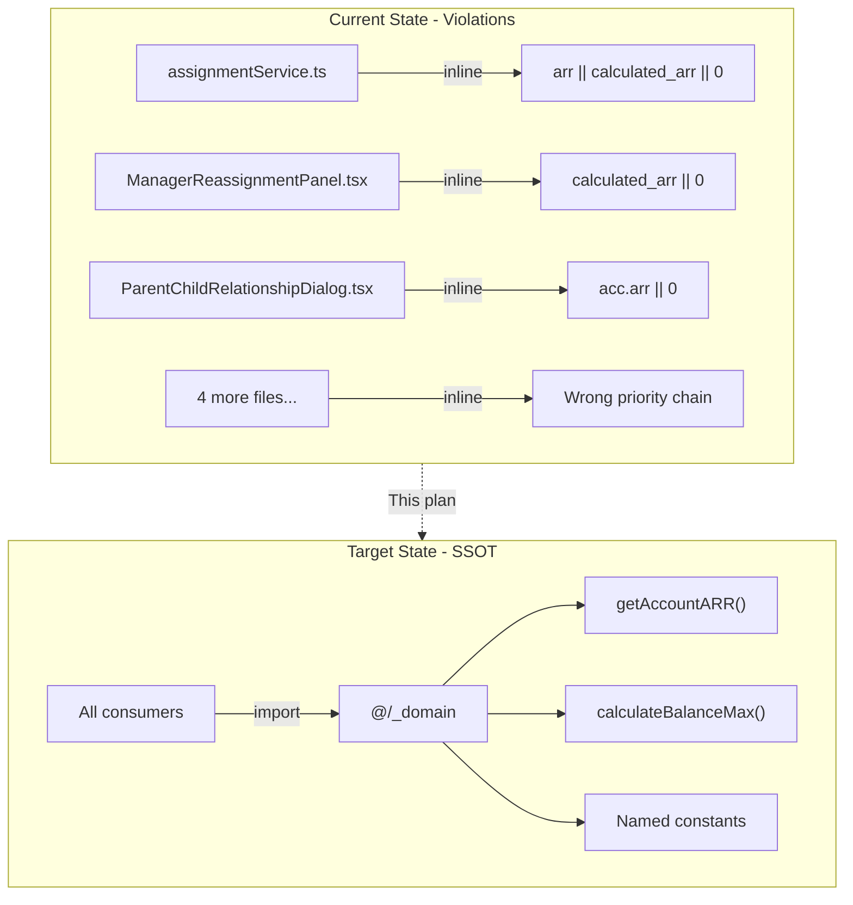

# SSOT Compliance and Hardcoded Logic Remediation (Revised)

This plan addresses all SSOT violations discovered in the code audit, organized by severity and logical grouping. **Revised based on reviewer feedback.**

---

## Review Response Summary

| Reviewer Concern | My Response | Action Taken |

|------------------|-------------|--------------|

| ManagerReassignmentPanel uses `select('*')` | **Agree** - Query uses `*` so all fields including `hierarchy_bookings_arr_converted` are available | No change needed - safe to use `getAccountARR()` |

| assignmentService.ts may be dead code | **Agree partially** - It IS imported and used by `AssignmentEngine.tsx` and `useAssignmentEngine.ts` | Keep fix but move to later phase, add verification step |

| Phase 3 redundant constants | **Agree** - `TARGET_BUFFER` and `LARGEST_ACCOUNT_BUFFER` already exist as `calculateBalanceMax()` default params | Reduce to only `APPROACHING_CAPACITY: 1.2` |

| Phase 5 weight key mismatch | **Agree** - Keys are `arr` vs `ARR`, `tiers` vs `TIER` | **Withdraw Phase 5** - refactor cost exceeds benefit |

| 30 vs 90 days unresolved | **Agree** - This is a business decision | **Defer Phase 7a** - requires product owner input |

| Phase 7b should use existing function | **Agree** - `getBalancePenaltyMultiplier()` already exists | Use the function instead of importing raw values |

| Testing strategy weak | **Agree** - Need baseline comparison | Add pre/post comparison step |

---

## Why These Fixes Matter

The codebase follows a **Domain-Driven Design** pattern where all business logic must flow through `src/_domain/`. When business logic is scattered across files:

1. **Double-counting risk**: The ARR priority chain (`hierarchy_bookings_arr_converted -> calculated_arr -> arr`) exists to prevent parent/child revenue double-counting. Using the wrong order breaks financial accuracy.

2. **Drift**: When the same calculation exists in 7 files, changing the formula requires 7 edits. Inevitably, some get missed.

3. **Auditability**: When stakeholders ask "how is ARR calculated?", the answer should be "check `_domain/calculations.ts`" — not "grep the codebase."

4. **Testing**: Centralized logic can be unit tested once. Scattered logic requires testing every consumer.



---

## Execution Order (Risk-Ordered)

Execute in this order to minimize risk:

1. **Phase 0**: Documentation only (zero risk)
2. **Phase 1**: Additive constants (zero risk)
3. **Phase 2**: Use domain function (low risk - same formula)
4. **Phase 3**: Telemetry fix (low risk - same values)
5. **Phase 4**: UI component ARR fixes (medium risk)
6. **Phase 5**: Legacy service ARR fixes (medium risk - verify first)

---

## Phase 0: Documentation Updates (Zero Risk)

**Why**: The code has comments claiming "intentional per MASTER_LOGIC.mdc" but MASTER_LOGIC.mdc doesn't document these intentional differences. Fix the docs to match reality.

### 0a. Add LP-specific geo scores to MASTER_LOGIC.mdc section 4.3:

```markdown
### 4.3.1 LP Solver Geography Scores (Tighter Constraints)

The LP solver uses more aggressive scoring to drive stronger geographic
alignment during optimization. These are intentionally lower than display scores:

| Match Type | Display Score | LP Score | Rationale |
|------------|---------------|----------|-----------|
| Exact match | 1.00 | 1.00 | Same |
| Sibling region | 0.85 | 0.65 | LP needs stronger geo pressure |
| Parent region | 0.65 | 0.40 | Penalize cross-subregion more |
| Global fallback | 0.40 | 0.20 | Discourage global assignments |

Display scores (`GEO_MATCH_SCORES` in constants.ts) show users a softer view for 
analytics. LP scores (`DEFAULT_LP_GEOGRAPHY_PARAMS` in types.ts) drive optimization behavior.
```

### 0b. Add LP variance documentation to MASTER_LOGIC.mdc section 12:

```markdown
### 12.2.1 LP Balance Variance (Tighter Than Display)

The LP solver uses tighter variance bands than the display defaults:

| Metric | Display Variance | LP Variance | Rationale |
|--------|------------------|-------------|-----------|
| ARR | 25% | 10% | LP needs stricter balance enforcement |
| ATR | 25% | 15% | Slightly looser for renewal timing |
| Pipeline | 25% | 15% | Slightly looser for prospect uncertainty |

Display variance (`DEFAULT_VARIANCE` in constants.ts) is for UI thresholds.
LP variance (`DEFAULT_LP_BALANCE_CONFIG` in types.ts) drives optimization constraints.
```

---

## Phase 1: Add Missing Constant (Low Risk)

**Why**: The value `1.2` appears in 10+ places for "approaching capacity" warnings. Only add what's truly new.

**Note**: `TARGET_BUFFER (1.5)` and `LARGEST_ACCOUNT_BUFFER (1.2)` are NOT added because they already exist as default parameters in `calculateBalanceMax()`.

### Add to constants.ts:

```typescript
/**
 * APPROACHING CAPACITY THRESHOLD
 * ------------------------------
 * Warning threshold - rep is "approaching capacity" at 120% of target.
 * Used in ManagerReassignmentPanel.tsx and other capacity warnings.
 * 
 * @see MASTER_LOGIC.mdc 12.1.2
 */
export const APPROACHING_CAPACITY_THRESHOLD = 1.2;
```

---

## Phase 2: Use Domain Balance Function (Low Risk)

**Why**: [FullAssignmentConfig.tsx](book-ops-workbench/src/components/FullAssignmentConfig.tsx) duplicates the `calculateBalanceMax` formula. Import the function instead.

### Current code (lines 445-448):

```typescript
const recommendedCustomerMax = Math.max(
  Math.round(recommendedCustomerTarget * 1.5),
  Math.round(maxAccountARR * 1.2)
);
```

### Target code:

```typescript
import { calculateBalanceMax } from '@/_domain';
// ...
const recommendedCustomerMax = Math.round(
  calculateBalanceMax(recommendedCustomerTarget, maxAccountARR)
);
```

Apply same pattern for:

- Prospect max (line 455)
- ATR max (lines 463-466) 
- CRE max (lines 470-473)

---

## Phase 3: Fix Telemetry Intensity (Low Risk)

**Why**: [optimizationTelemetry.ts](book-ops-workbench/src/services/optimization/telemetry/optimizationTelemetry.ts) lines 115-122 duplicate intensity values that already exist in constants.ts.

### Current code:

```typescript
function getIntensityMultiplier(intensity: string): number {
  // These values must match BALANCE_INTENSITY_PRESETS in _domain/constants.ts
  const presets: Record<string, number> = {
    VERY_LIGHT: 0.1,
    LIGHT: 0.5,
    NORMAL: 1.0,
    HEAVY: 10.0,
    VERY_HEAVY: 100.0
  };
  return presets[intensity] ?? 1.0;
}
```

### Target code:

```typescript
import { getBalancePenaltyMultiplier, BALANCE_INTENSITY_PRESETS, BalanceIntensity } from '@/_domain';

function getIntensityMultiplier(intensity: string): number {
  // Validate it's a known intensity, else default to NORMAL
  if (intensity in BALANCE_INTENSITY_PRESETS) {
    return getBalancePenaltyMultiplier(intensity as BalanceIntensity);
  }
  return 1.0; // default for unknown
}
```

---

## Phase 4: Fix UI Component ARR Calculations (Medium Risk)

**Why**: These files use inline ARR calculations instead of `getAccountARR()`. The Supabase queries use `select('*')` so all fields are available.

### Files to fix:

| File | Lines | Current | Fix |

|------|-------|---------|-----|

| [ManagerReassignmentPanel.tsx](book-ops-workbench/src/components/ManagerReassignmentPanel.tsx) | 153, 158, 161, 164, 167, 271 | `a.calculated_arr \|\| 0` | `getAccountARR(a)` |

| [ParentChildRelationshipDialog.tsx](book-ops-workbench/src/components/ParentChildRelationshipDialog.tsx) | 88, 318, 380 | `acc.arr \|\| 0` | `getAccountARR(acc)` |

| [ChangeChildOwnerDialog.tsx](book-ops-workbench/src/components/ChangeChildOwnerDialog.tsx) | 183 | `childAccount.arr \|\| 0` | `getAccountARR(childAccount)` |

| [UnassignedAccountsModal.tsx](book-ops-workbench/src/components/UnassignedAccountsModal.tsx) | 456, 457 | `account.calculated_arr \|\| 0` | `getAccountARR(account)` |

| [SameBuildClashDetector.tsx](book-ops-workbench/src/components/SameBuildClashDetector.tsx) | 72 | `account.calculated_arr \|\| 0` | `getAccountARR(account)` |

| [GlobalClashDetector.tsx](book-ops-workbench/src/pages/GlobalClashDetector.tsx) | 120 | `account.calculated_arr \|\| 0` | `getAccountARR(account)` |

**Implementation**: Add `import { getAccountARR } from '@/_domain';` to each file and replace inline calculations.

---

## Phase 5: Fix Legacy assignmentService.ts (Medium Risk)

**Status**: This service IS actively used - imported by `AssignmentEngine.tsx` and `useAssignmentEngine.ts`.

**Why**: Uses inverted priority chain (`arr || calculated_arr`) instead of correct chain.

### Pre-fix verification:

1. Confirm which code paths are actually executed in production
2. The primary engine is now `simplifiedAssignmentEngine.ts` which already uses `getAccountARR()`
3. `assignmentService.ts` may only be used for certain rule types

### Lines to fix:

| Line | Current | Fix |

|------|---------|-----|

| 662 | `account.arr \|\| account.calculated_arr \|\| 0` | `getAccountARR(account)` |

| 680 | `account.arr \|\| account.calculated_arr \|\| 0` | `getAccountARR(account)` |

| 980 | `acc.arr \|\| acc.calculated_arr \|\| 0` | `getAccountARR(acc)` |

| 1728 | `account.arr \|\| account.calculated_arr \|\| 0` | `getAccountARR(account)` |

| 1740 | `account.arr \|\| account.calculated_arr \|\| 0` | `getAccountARR(account)` |

| 1758 | `acc.arr \|\| acc.calculated_arr \|\| 0` | `getAccountARR(acc)` |

**Note**: This file already imports `getAccountARR` (line 3) but doesn't use it consistently!

---

## DEFERRED: Items Requiring Business Decisions

### Deferred 1: 30 vs 90 Days Continuity Default

[assignmentService.ts](book-ops-workbench/src/services/assignmentService.ts) line 726 uses:

```typescript
const minimumOwnershipDays = conditions.minimumOwnershipDays || 30;
```

But `DEFAULT_CONTINUITY_DAYS` in constants.ts is 90 days.

**Question for product owner**: Which is correct?

- 30 days: Update `DEFAULT_CONTINUITY_DAYS` to 30
- 90 days: Update assignmentService.ts to use the constant

### Deferred 2: Weight Key Name Consolidation

[lpProblemBuilder.ts](book-ops-workbench/src/services/optimization/constraints/lpProblemBuilder.ts) uses lowercase keys (`arr`, `atr`, `tiers`) while `DEFAULT_OPTIMIZATION_WEIGHTS` uses uppercase (`ARR`, `ATR`, `TIER`).

**Decision**: The refactor cost (updating all references to use new key names) exceeds the benefit. Leave as-is but document in code comment that values are intentionally duplicated.

---

## Files Changed Summary

| Phase | Files Modified | Risk Level |

|-------|----------------|------------|

| Phase 0 | 1 file (MASTER_LOGIC.mdc) | None (documentation) |

| Phase 1 | 1 file (constants.ts) | Low (additive only) |

| Phase 2 | 1 file (FullAssignmentConfig.tsx) | Low (same formula, just imported) |

| Phase 3 | 1 file (optimizationTelemetry.ts) | Low (same values) |

| Phase 4 | 6 UI component files | Medium (changes calculation results) |

| Phase 5 | 1 file (assignmentService.ts) | Medium (legacy service) |

**Total**: 11 files modified

---

## Testing Strategy (Enhanced per reviewer feedback)

### Pre-change baseline:

1. Run assignment on a test build, note total ARR, proposal count
2. Export or screenshot key metrics

### After each phase:

1. Run `npm run lint` to catch import errors
2. Run `npm run build` to verify TypeScript compilation

### Post-change validation (after Phase 4 and 5):

1. Run same assignment on test build
2. Compare:

                                                                                                                                                                                                                                                                                                                                                                                                                                                                                                                                                                                                                                                                                                                                                                                                - Total ARR should match within 0.1% (rounding)
                                                                                                                                                                                                                                                                                                                                                                                                                                                                                                                                                                                                                                                                                                                                                                                                - Proposal count should be identical
                                                                                                                                                                                                                                                                                                                                                                                                                                                                                                                                                                                                                                                                                                                                                                                                - If any differ, investigate hierarchy accounts

3. Manual spot-check: View 5 high-ARR accounts in dashboard

---

## Changelog Entry

```markdown
## [2025-12-22] - SSOT: Comprehensive Business Logic Consolidation

**Summary:** Fixed all SSOT violations identified in code audit. All business
logic now flows through `@/_domain` as required by architecture.

### Phase 0: Documentation
- Documented LP-specific geo scores in MASTER_LOGIC.mdc 4.3.1
- Documented LP variance differences in MASTER_LOGIC.mdc 12.2.1

### Phase 1: New Constants
- Added `APPROACHING_CAPACITY_THRESHOLD` to constants.ts

### Phase 2: Balance Function Usage
- FullAssignmentConfig.tsx now uses `calculateBalanceMax()` from @/_domain

### Phase 3: Telemetry Fix
- optimizationTelemetry.ts now uses `getBalancePenaltyMultiplier()` from @/_domain

### Phase 4-5: ARR Calculation Fixes
- Replaced inline ARR calculations in 7 files with `getAccountARR()` from @/_domain
- Fixes potential double-counting in hierarchy rollups

### Deferred
- 30 vs 90 days continuity default: Awaiting product decision
- Weight key consolidation: Cost exceeds benefit, documented in code
```

---

## Disagreements with Reviewer

| Reviewer Point | My Response |

|----------------|-------------|

| "ManagerReassignmentPanel query may not include hierarchy_bookings_arr_converted" | **Disagree** - The query uses `select('*')` (lines 66, 76) which includes all columns. Verified in code. |

| "assignmentService.ts may be dead code" | **Partially disagree** - It IS actively imported and used. However, I agree we should verify which specific code paths execute before changing. |

| "Phase 5 weight key mismatch is HIGH severity" | **Disagree on severity** - The values are identical, only key names differ. Runtime behavior is unchanged. It's a code hygiene issue, not a bug. Defer for lower priority cleanup. |