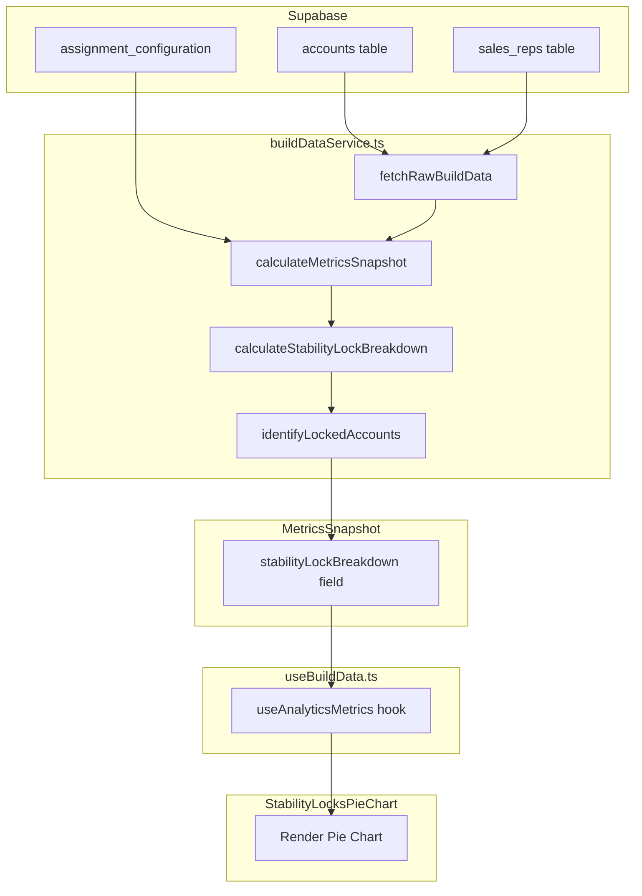

# Stability Locks Pie Chart - Revised Plan

## Overview

Add a "Stability Locks" pie chart showing accounts that would be locked during assignment, categorized by lock reason. Only shows locked accounts (no "unlocked" slice). Follows the exact pattern of `TeamFitPieChart`.

## Key Design Decisions

| Decision | Rationale |

|----------|-----------|

| Use `identifyLockedAccounts()` | Already returns `lockStats` - no need to reinvent |

| Extend existing config query | Avoid duplicate Supabase calls |

| No "unlocked" field | Per user: only care about accounts with stability priority |

| Explicit interface fields | Matches `TierAlignmentBreakdown` pattern for consistency |

| Cache via MetricsSnapshot | Automatic invalidation through existing hooks |

## Lock Types (from [stabilityLocks.ts](book-ops-workbench/src/services/optimization/constraints/stabilityLocks.ts))

| Lock Type | Display Name | Color | Description |

|-----------|--------------|-------|-------------|

| `cre_risk` | CRE Risk | Red | At-risk accounts stay with experienced owner |

| `renewal_soon` | Renewal Soon | Amber | Renewing soon - avoid disruption |

| `pe_firm` | PE Firm | Violet | PE-owned accounts routed to dedicated rep |

| `backfill_migration` | Backfill | Blue | Owner leaving - migrating to replacement |

| `manual_lock` | Manual Lock | Emerald | Manually excluded from reassignment |

| `recent_change` | Recent Change | Gray | Recently changed owner - minimize churn |

---

## Step 1: Add Type Definition

**File**: [types/analytics.ts](book-ops-workbench/src/types/analytics.ts)

Add after `TierAlignmentBreakdown` interface (~line 236):

```typescript
/**
 * Stability lock breakdown for pie chart visualization
 * Only includes locked accounts - unlocked accounts are not shown
 * 
 * Lock types are defined in services/optimization/constraints/stabilityLocks.ts
 * @see MASTER_LOGIC.mdc §11.5 - Account Locking Priorities
 */
export interface StabilityLockBreakdown {
  manualLock: number;
  backfillMigration: number;
  creRisk: number;
  renewalSoon: number;
  peFirm: number;
  recentChange: number;
  total: number;
}
```

Add to `MetricsSnapshot` interface (~line 280):

```typescript
/** Stability lock breakdown for pie chart */
stabilityLockBreakdown: StabilityLockBreakdown;
```

---

## Step 2: Add Calculation to buildDataService

**File**: [services/buildDataService.ts](book-ops-workbench/src/services/buildDataService.ts)

### 2a. Add imports at top of file:

```typescript
import { identifyLockedAccounts } from '@/services/optimization/constraints/stabilityLocks';
import { DEFAULT_LP_STABILITY_CONFIG } from '@/services/optimization/types';
import type { LPStabilityConfig, AggregatedAccount, EligibleRep } from '@/services/optimization/types';
import type { StabilityLockBreakdown } from '@/types/analytics';
```

### 2b. Add method to BuildDataService class (after `calculateTierAlignmentBreakdown`):

```typescript
/**
 * Calculate stability lock breakdown for pie chart
 * Uses the same logic as the assignment engine for consistency
 * 
 * @see MASTER_LOGIC.mdc §11.5 - Account Locking Priorities
 */
private calculateStabilityLockBreakdown(
  accounts: any[],
  salesReps: any[],
  stabilityConfig: LPStabilityConfig
): StabilityLockBreakdown {
  const parentAccounts = accounts.filter(a => a.is_parent);
  
  // Convert raw DB types to optimization types (only fields needed for stability check)
  const aggregatedAccounts: AggregatedAccount[] = parentAccounts.map(a => ({
    sfdc_account_id: a.sfdc_account_id,
    account_name: a.account_name || '',
    aggregated_arr: getAccountARR(a),
    aggregated_atr: getAccountATR(a),
    pipeline_value: 0,
    child_ids: [],
    is_parent: true,
    owner_id: a.owner_id,
    owner_name: a.owner_name,
    owner_change_date: a.owner_change_date,
    owners_lifetime_count: a.owners_lifetime_count,
    is_customer: getAccountARR(a) > 0,
    is_strategic: a.is_strategic || false,
    sales_territory: a.sales_territory,
    geo: a.geo,
    employees: a.employees,
    enterprise_vs_commercial: a.enterprise_vs_commercial,
    tier: null,
    expansion_tier: a.expansion_tier,
    initial_sale_tier: a.initial_sale_tier,
    cre_risk: a.cre_risk,
    renewal_date: a.renewal_date,
    pe_firm: a.pe_firm,
    exclude_from_reassignment: a.exclude_from_reassignment,
  }));
  
  const eligibleReps: EligibleRep[] = salesReps.map(r => ({
    rep_id: r.rep_id,
    name: r.name,
    region: r.region,
    team_tier: r.team_tier,
    pe_firms: r.pe_firms,
    is_active: r.is_active ?? true,
    include_in_assignments: r.include_in_assignments ?? true,
    is_strategic_rep: r.is_strategic_rep || false,
    is_backfill_source: r.is_backfill_source,
    is_backfill_target: r.is_backfill_target,
    backfill_target_rep_id: r.backfill_target_rep_id,
    current_arr: 0,
  }));
  
  // Use existing function - it already computes lockStats!
  const { lockStats } = identifyLockedAccounts(
    aggregatedAccounts,
    eligibleReps,
    stabilityConfig
  );
  
  const total = Object.values(lockStats).reduce((sum, count) => sum + count, 0);
  
  return {
    manualLock: lockStats.manual_lock || 0,
    backfillMigration: lockStats.backfill_migration || 0,
    creRisk: lockStats.cre_risk || 0,
    renewalSoon: lockStats.renewal_soon || 0,
    peFirm: lockStats.pe_firm || 0,
    recentChange: lockStats.recent_change || 0,
    total,
  };
}
```

### 2c. Update `calculateMetricsSnapshot` method:

Extend the config query to include `lp_stability_config`:

```typescript
const { data: configData } = await supabase
  .from('assignment_configuration')
  .select('territory_mappings, lp_stability_config')  // ADD lp_stability_config
  .eq('build_id', buildId)
  .order('created_at', { ascending: false })
  .limit(1)
  .maybeSingle();

// Merge stability config with defaults
const stabilityConfig: LPStabilityConfig = {
  ...DEFAULT_LP_STABILITY_CONFIG,
  ...(configData?.lp_stability_config as Partial<LPStabilityConfig> || {})
};
```

Add to the return object:

```typescript
return {
  // ... existing fields ...
  tierAlignmentBreakdown: this.calculateTierAlignmentBreakdown(accounts, salesReps, useProposed),
  stabilityLockBreakdown: this.calculateStabilityLockBreakdown(accounts, salesReps, stabilityConfig),  // ADD
  repDistribution: this.calculateRepDistribution(accounts, salesReps, opportunities, useProposed),
  // ... rest ...
};
```

---

## Step 3: Create Pie Chart Component

**File**: `components/analytics/StabilityLocksPieChart.tsx` (new file)

Follow [TeamFitPieChart.tsx](book-ops-workbench/src/components/analytics/TeamFitPieChart.tsx) pattern exactly:

- Props: `{ breakdown: StabilityLockBreakdown, title?, compact? }`
- Donut pie chart with legend
- Tooltip with description on hover
- Empty state: "No stability locks active"
- Color-coded by severity (red for risk, amber for time-sensitive, etc.)

---

## Step 4: Export Component

**File**: [components/analytics/index.ts](book-ops-workbench/src/components/analytics/index.ts)

```typescript
export { StabilityLocksPieChart } from './StabilityLocksPieChart';
```

---

## Step 5: Integrate into BalancingSuccessMetrics

**File**: [components/balancing/BalancingSuccessMetrics.tsx](book-ops-workbench/src/components/balancing/BalancingSuccessMetrics.tsx)

The `BalancingSuccessMetrics` component is already used by both `BookBalancingDashboard` and `TerritoryBalancingDashboard`. It currently renders a 3-column grid:

1. Continuity Card
2. Geo Alignment Card
3. Priority Distribution Pie

**Changes needed:**

1. Add `stabilityLockBreakdown` to props interface:
```typescript
interface BalancingSuccessMetricsProps {
  buildId: string;
  continuityScore: number;
  continuityMetrics?: ContinuityMetrics;
  geoAlignment: GeoAlignmentMetrics | null;
  stabilityLockBreakdown?: StabilityLockBreakdown;  // ADD
  isLoading?: boolean;
}
```

2. Import and add the Stability Locks card as a 4th card in the grid:
```tsx
import { StabilityLocksPieChart } from '@/components/analytics';

// Update grid to 4 columns on large screens:
<div className="grid grid-cols-1 md:grid-cols-2 lg:grid-cols-4 gap-4">
  {/* Continuity Card */}
  {/* Geo Alignment Card */}
  {/* Priority Distribution Pie */}
  {/* Stability Locks Pie - ADD */}
  {stabilityLockBreakdown && stabilityLockBreakdown.total > 0 && (
    <StabilityLocksPieChart 
      breakdown={stabilityLockBreakdown}
      compact
    />
  )}
</div>
```

3. Update both dashboard pages to pass the new prop:
```tsx
// In BookBalancingDashboard.tsx and TerritoryBalancingDashboard.tsx:
<BalancingSuccessMetrics
  buildId={buildId}
  continuityScore={analyticsMetrics?.lpMetrics?.continuityScore ?? 0}
  continuityMetrics={analyticsMetrics?.lpMetrics?.continuityMetrics}
  geoAlignment={analyticsMetrics?.geoAlignment || null}
  stabilityLockBreakdown={analyticsMetrics?.stabilityLockBreakdown}  // ADD
  isLoading={analyticsLoading}
/>
```


**Note**: The chart only appears when `total > 0` (i.e., there are locked accounts). If no stability locks are active, the grid remains 3 columns.

---

## Data Flow Diagram



---

## Disagreements with Reviewer

| Reviewer Suggestion | My Decision | Rationale |

|---------------------|-------------|-----------|

| Add `unassigned` and `ineligibleOwner` fields | **Rejected** | Per user clarification: only show accounts with stability lock priority. Accounts without owners don't get stability locks. |

| Use `Record<StabilityLockType, number>` for SSOT | **Rejected** | Explicit fields match `TierAlignmentBreakdown` pattern. TypeScript autocomplete is better. Added comment referencing source. |

| Performance optimization for N×M | **Not needed** | `identifyLockedAccounts()` handles this internally with pre-indexed rep lookup. |