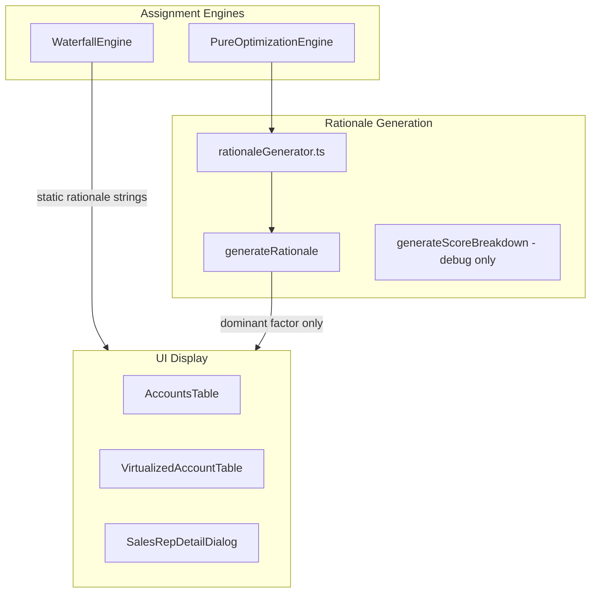

# Transparent Assignment Rationale Weights

## Problem Statement

Current assignment rationales only show the **dominant** factor:
> "P4: Geography Match → Sarah (AMER - exact geo match, score 0.85)"

Users cannot see how multiple factors influenced the decision. When Geography contributes 65%, Continuity 25%, and Balance 10%, that context is hidden.

**Goal**: Show weight breakdowns when multiple factors contribute significantly (>10%):
> "P4: Sarah - Geography was primary (65%), with Continuity (25%) also contributing"

## Current Architecture



## Key Files

- [`rationaleGenerator.ts`](book-ops-workbench/src/services/optimization/postprocessing/rationaleGenerator.ts) - Main rationale generation logic (needs refactoring)
- [`simplifiedAssignmentEngine.ts`](book-ops-workbench/src/services/simplifiedAssignmentEngine.ts) - Waterfall engine (needs to use shared rationale generator)
- [`_domain/constants.ts`](book-ops-workbench/src/_domain/constants.ts) - SSOT for threshold constant
- [`AccountsTable.tsx`](book-ops-workbench/src/components/data-tables/AccountsTable.tsx) - UI display of rationale

## Implementation Plan

### 1. SSOT Documentation

Update [`MASTER_LOGIC.mdc`](book-ops-workbench/src/_domain/MASTER_LOGIC.mdc) with new section on rationale transparency rules, including the 10% threshold and output format specifications.

### 2. Domain Constants

Add to [`_domain/constants.ts`](book-ops-workbench/src/_domain/constants.ts):

```typescript
/** Factors below this threshold are hidden from rationale breakdown */
export const SIGNIFICANT_CONTRIBUTION_THRESHOLD = 0.10;
```

Export from [`_domain/index.ts`](book-ops-workbench/src/_domain/index.ts).

### 3. Refactor Rationale Generator

Modify [`rationaleGenerator.ts`](book-ops-workbench/src/services/optimization/postprocessing/rationaleGenerator.ts):

- Refactor `generateRationale()` to calculate percentage contributions
- Filter to factors >= 10% threshold
- Add `buildContributionBreakdown()` helper for natural language formatting
- Add `getSingleFactorDescription()` for single-factor cases

### 4. Waterfall Engine Integration

Update [`simplifiedAssignmentEngine.ts`](book-ops-workbench/src/services/simplifiedAssignmentEngine.ts) to import and use the shared `generateRationale()` function instead of inline static strings.

### 5. Changelog

Add entry to [`CHANGELOG.md`](CHANGELOG.md) documenting the transparency enhancement.

## Example Outputs

| Scenario | Before | After |
|----------|--------|-------|
| Multi-factor | `P4: Geography Match → Sarah (score 0.85)` | `P4: Sarah - Geography was primary (65%), with Continuity 25% also contributing` |
| Single dominant | `P5: Account Continuity → John (score 0.72)` | `P5: John - long-term relationship preserved (score 0.72)` |
| Balance-driven | `RO: Balance Optimization → Alex` | `RO: Alex - optimized for balance (score 0.28)` |