# Book Builder v1.4 - System Architecture

> Last Updated: 2025-12-22

This document provides a comprehensive visual map of the Book Builder application architecture, including page hierarchy, component relationships, service layers, and data flow.

---

## Table of Contents

1. [High-Level System Overview](#1-high-level-system-overview)
2. [Application Routing & Page Hierarchy](#2-application-routing--page-hierarchy)
3. [Build Detail - The Hub](#3-build-detail---the-hub)
4. [Component Architecture](#4-component-architecture)
5. [Service Layer Architecture](#5-service-layer-architecture)
6. [Domain Layer (SSOT)](#6-domain-layer-ssot)
7. [Data Flow](#7-data-flow)
8. [Assignment Engine Deep Dive](#8-assignment-engine-deep-dive)
9. [Key Component Dependencies](#9-key-component-dependencies)
10. [Potential Duplication Analysis](#10-potential-duplication-analysis)

---

## 1. High-Level System Overview


---

## 2. Application Routing & Page Hierarchy

```mermaid
flowchart TD
    subgraph App["App.tsx (Root)"]
        Providers["Providers Stack"]
    end
    
    Providers --> QueryClient["QueryClientProvider"]
    QueryClient --> ThemeProvider
    ThemeProvider --> TooltipProvider
    TooltipProvider --> AuthProvider
    AuthProvider --> Router["BrowserRouter"]
    
    Router --> Routes
    
    subgraph Routes["Route Definitions"]
        Auth["/auth → Auth.tsx"]
        Dashboard["/ → Index.tsx → Dashboard.tsx"]
        BuildDetail["/build/:id → BuildDetail.tsx"]
        Review["/review → ReviewNotes.tsx"]
        Summary["/summary → SummaryImpact.tsx"]
        Governance["/governance → Governance.tsx"]
        Manager["/manager-dashboard → ManagerDashboard.tsx"]
        RevOps["/revops-final → RevOpsFinalView.tsx"]
        Settings["/settings → Settings.tsx"]
        NotFound["* → NotFound.tsx"]
    end
    
    Routes --> ProtectedRoute["ProtectedRoute wrapper"]
    ProtectedRoute --> Layout["Layout wrapper"]
    
    style BuildDetail fill:#f9f,stroke:#333,stroke-width:4px
```



### Page Roles

| Page | Purpose | Access |
|------|---------|--------|
| **Dashboard** | Build list management (create, edit, delete, duplicate) | All authenticated |
| **BuildDetail** | **Main workflow hub** - 6-tab wizard for book building | All authenticated |
| **ManagerDashboard** | FLM approval queue and team review | FLM role |
| **RevOpsFinalView** | Final export and approval workflow | RevOps role |
| **Settings** | User preferences, version info | All authenticated |
| **Governance** | Role and permission management | Admin only |

---

## 3. Build Detail - The Hub

The `BuildDetail.tsx` page is the **primary workflow hub**. Everything happens inside a Build context.


### Tab Unlock Logic


---

## 4. Component Architecture

### Component Categories


### Key Component Hierarchy (Assignment Flow)


---

## 5. Service Layer Architecture


### Service Responsibilities

| Service | Responsibility |
|---------|---------------|
| `simplifiedAssignmentEngine.ts` | **Primary** - Waterfall priority rules + LP optimization |
| `assignmentService.ts` | **Legacy** - Original rule engine (still used for some flows) |
| `pureOptimizationEngine.ts` | Orchestrates HiGHS LP solver for optimal assignments |
| `buildDataService.ts` | Centralized data fetching with caching |
| `batchImportService.ts` | Streaming CSV import with validation |
| `balanceThresholdCalculator.ts` | Computes rep capacity thresholds |

---

## 6. Domain Layer (SSOT)

The `_domain/` folder is the **Single Source of Truth** for all business logic.

```mermaid
flowchart TD
    subgraph Domain["_domain/ (Source of Truth)"]
        ML["MASTER_LOGIC.mdc<br/>📚 Documentation"]
        
        subgraph Code["Implementation Files"]
            CALC["calculations.ts<br/>getAccountARR()<br/>getAccountATR()<br/>calculateBalanceMax()"]
            TIERS["tiers.ts<br/>classifyTeamTier()<br/>TIER_THRESHOLDS"]
            GEO["geography.ts<br/>REGION_HIERARCHY<br/>normalizeRegion()"]
            CONST["constants.ts<br/>All thresholds<br/>DEFAULT_* values"]
            NORM["normalization.ts<br/>Data cleanup<br/>Typo handling"]
        end
        
        INDEX["index.ts<br/>(Re-exports all)"]
    end
    
    ML -.->|"Documents"| Code
    Code --> INDEX
    INDEX -->|"import from '@/_domain'"| Consumers
    
    subgraph Consumers["Consumer Layers"]
        Components
        Services
        Hooks
        Utils
    end
    
    style ML fill:#ffd,stroke:#333
    style Domain fill:#e8f5e9
```



### SSOT Flow (Mandatory)

```mermaid
flowchart LR
    Step1["1️⃣ MASTER_LOGIC.mdc<br/>Document rule first"]
    Step2["2️⃣ _domain/*.ts<br/>Implement function"]
    Step3["3️⃣ Consumer files<br/>Import and use"]
    
    Step1 --> Step2 --> Step3
    
    style Step1 fill:#ffeb3b
    style Step2 fill:#4caf50,color:#fff
    style Step3 fill:#2196f3,color:#fff
```



---

## 7. Data Flow

### Import → Assignment → Review Flow


### React Query Data Flow


---

## 8. Assignment Engine Deep Dive


### Priority Waterfall (Simplified)


---

## 9. Key Component Dependencies

### Which components use which hooks/services?


---

## 10. Potential Duplication Analysis

### Areas to Watch

| Area | Status | Notes |
|------|--------|-------|
| **ARR Calculation** | ⚠️ Some violations | Should ONLY use `getAccountARR()` from `@/_domain` |
| **Assignment Services** | 🔴 Multiple engines | `assignmentService.ts` vs `simplifiedAssignmentEngine.ts` - need to consolidate |
| **Balance Thresholds** | ✅ Centralized | Uses `calculateBalanceMax()` from `@/_domain` |
| **Geography Scoring** | ✅ Centralized | Single source in `_domain/geography.ts` |
| **Tier Classification** | ✅ Centralized | Single source in `_domain/tiers.ts` |

### Component Duplication Check


### Recommended Cleanup

1. **`SimplifiedAssignmentConfig.tsx`** - Appears to be superseded by `FullAssignmentConfig.tsx`. Consider deprecating.

2. **`assignmentService.ts`** - Legacy engine with some SSOT violations. Consider:
   - Auditing which code paths still use it
   - Migrating remaining usage to `simplifiedAssignmentEngine.ts`
   - Eventually deprecating

3. **Inline ARR calculations** - Several files still use inline `calculated_arr || arr || 0` instead of `getAccountARR()`. Track these in the SSOT compliance plan.

---

## Quick Reference: File Locations

| Need | File |
|------|------|
| **Business rules** | `src/_domain/MASTER_LOGIC.mdc` |
| **App routing** | `src/App.tsx` |
| **Main workflow** | `src/pages/BuildDetail.tsx` |
| **Assignment logic** | `src/pages/AssignmentEngine.tsx` |
| **LP optimization** | `src/services/optimization/pureOptimizationEngine.ts` |
| **Primary engine** | `src/services/simplifiedAssignmentEngine.ts` |
| **Data loading** | `src/services/buildDataService.ts` |
| **Constants** | `src/_domain/constants.ts` |
| **Calculations** | `src/_domain/calculations.ts` |

---

## Summary

The Book Builder architecture follows a clear layered pattern:

1. **Pages** → Define routes and layout
2. **Components** → UI building blocks
3. **Hooks** → React state and data fetching
4. **Services** → Business logic orchestration
5. **Domain** → Single Source of Truth for calculations and constants

The critical flow is:
```
Dashboard → BuildDetail (hub) → 6-tab wizard → Assignment Engine → LP Optimization → Review
```

All business logic **must** flow through `_domain/` per the SSOT rules.

